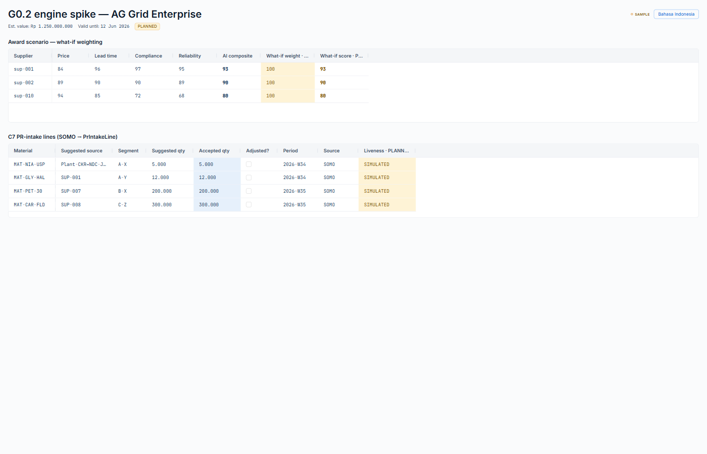
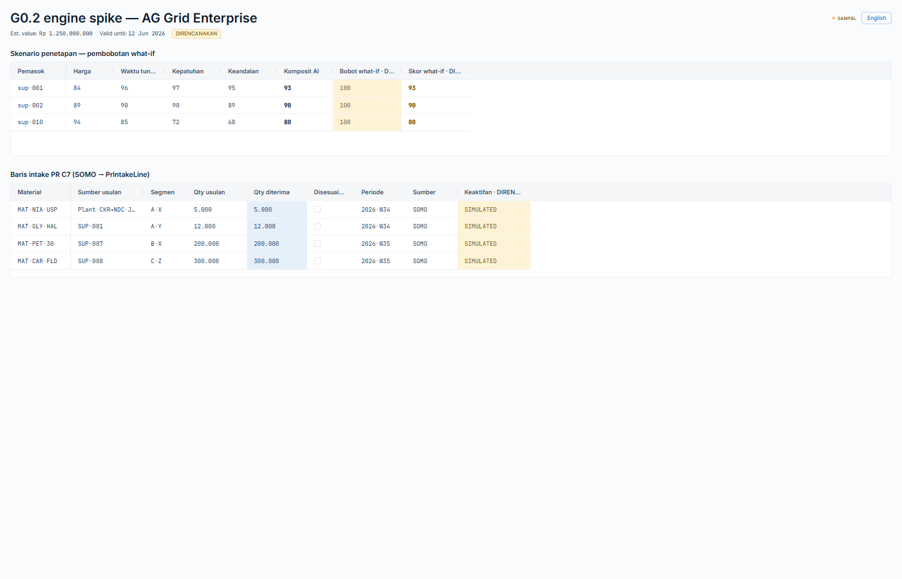
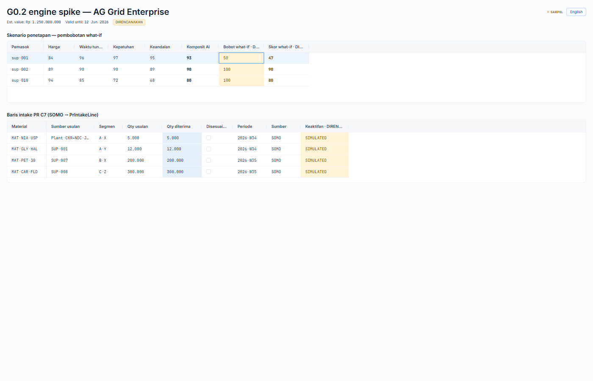
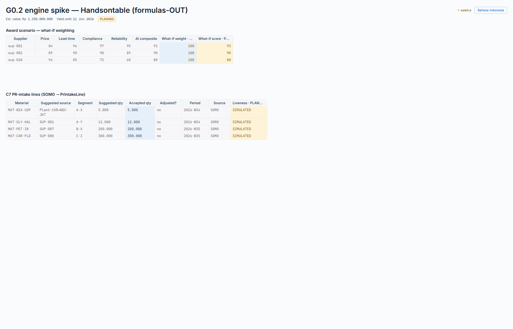
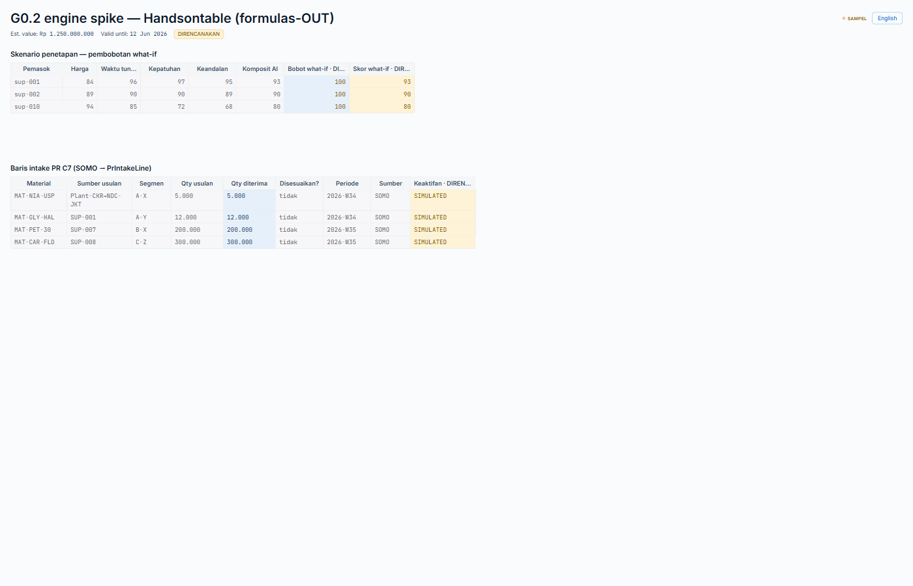
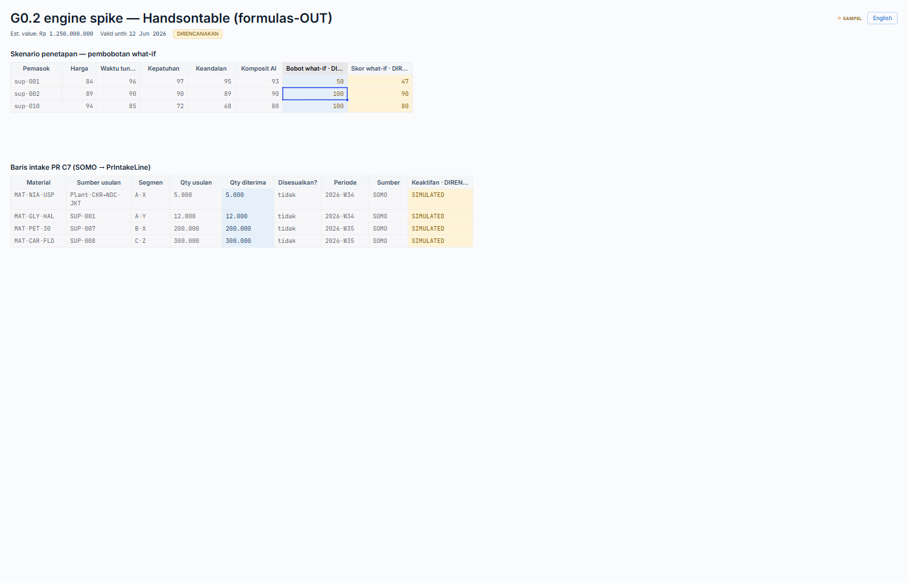

# G0.2 — Grid engine bake-off scorecard

**Batch:** Stage G · G0.2 (the engine spike that rules FORK-G1) · **generated at** `main` #68
(`768b863`, floor 662). **Status:** SPIKE COMPLETE — throwaway harnesses built, measured,
retired; this scorecard is the only artifact that lands on `main`.

**What this is.** The bake-off mandated by `docs/Stage_G_Grid_Planning_Layer_Plan_v1.md` §3:
**AG Grid Enterprise vs Handsontable + HyperFormula**, each bound to ONE identical harness, scored
on 8 axes with four disqualifying hard gates. It produces the evidence that lets the operator rule
**FORK-G1** (which engine the Grid is built on). It does **not** rule it — FORK-G1 stays OPEN.

**Honesty of this measurement (read first).** Applying the portal's own honest-render discipline
to the spike itself: not every axis could be *empirically exercised* in a headless Linux/Windows
CI-class environment. Each axis below is tagged with its **evidence basis**:

- **MEASURED** — empirically produced in this environment (bundle bytes, `vitest`/`jsdom` mount,
  live DP-3 render, live EN/ID render, live edit→overlay recompute, formula tree-shake grep).
- **INSPECTED** — read from the built DOM / ARIA attributes / registered module set.
- **DOCUMENTED** — from the vendor's shipped capability + docs, **not** exercised here (real-Excel
  clipboard round-trip and real screen-reader announcement need a desktop Excel + an AT bridge this
  environment lacks). Flagged so a DOCUMENTED verdict is never read as a MEASURED one.

---

## 0. Method — the one identical harness

Built once as an engine-agnostic spec (`src/pages-v2/_spike/harnessModel.ts`, byte-identical on both
spike branches), bound to each engine, lazy-loaded on a dev route (`/_spike/grid`) so the commercial
engine lands in its **own async chunk**.

- **Award-scenario grid** — real quotations × criteria from the shipped `quotationStore` (RFQ-2026-003:
  sup-001/002/010), one **editable what-if weight** column, and a **PLANNED what-if score** column.
- **The what-if score is derived in PURE TS** (`whatIfScore()` in `harnessModel.ts`), never by an engine
  formula. This is the formulas-OUT design **and** the C6-doctrine proof: the engine emits the edit
  event; the harness recomputes; the **seam `aiCompositeScore` is never written** → the overlay is
  never merged into the seam (C6 §2).
- **C7 `PrIntakeLine` grid** — `material · suggestedSource(lane) · segment · suggestedQty/acceptedQty/
  wasAdjusted · period · source × liveness` (C7 §2), so each engine is tested against the **real intake
  shape the Grid will push** — with the SOMO seed line rendered honestly as **SIMULATED × PLANNED**
  (C7 §4), never committed/LIVE.
- **Portal chrome the engine must not fight:** `<LivenessPill>` (green structurally unreachable — reads
  the registry), DP-3 tokens (mono/`data-navy #1E3A5F`, quiet chips, light table grammar), an EN/ID
  toggle driving the real i18n singleton, and `formatIDR`/`formatDate` (Asia/Jakarta).

Both engines ran in **eval/trial mode — no licence purchased** (Q1 CONFIRMED): AG Grid on its trial
watermark; Handsontable on `licenseKey="non-commercial-and-evaluation"`.

---

## 1. Engines, versions, licence terms

| | **AG Grid Enterprise** | **Handsontable (+ HyperFormula)** |
|---|---|---|
| Installed (eval) | `ag-grid-react` + `ag-grid-community` + `ag-grid-enterprise` **35.1.0** | `handsontable` **17.1.0** + `@handsontable/react` **16.2.0** |
| Formula engine | in-package `FormulaModule` (v35.1 Formula Editor) — **opt-in, not registered here** | **HyperFormula 3.3.0** — an **`optionalDependency`** of handsontable; used only if the Formulas plugin is registered |
| Licence | Commercial **per-developer**. `ag-grid-community` (MIT) exists but **lacks** range-selection / fill-handle / clipboard / Excel-export (the Excel-UX under test). | Commercial **per-developer**; free non-commercial/eval tier. **HyperFormula is dual-licensed GPLv3 *or* proprietary.** |
| List price | **$999/dev perpetual** (incl. 1 yr support+updates); subscription ≈ $995–1,995/dev/yr; Grid+Charts bundle $1,598/dev | ≈ **$979/dev** standard annual (1 app, unlimited end-users); perpetual available; HyperFormula proprietary priced separately by end-user tier |
| Transitive weight | none notable | hard-deps **`moment@2.30.1`**, `numbro@2.5.0`, `dompurify` — bundled regardless of formulas |

> **⚠️ OPERATOR DECISION WITH LEAD TIME (FORK-5-class).** Both frontrunners are **commercial,
> per-developer** buys. The spike needs no purchase; a production `main` wiring of either does. The
> licence commitment — and, for Handsontable, the **GPLv3-vs-proprietary HyperFormula** question if
> formulas are ever wanted — is the operator's post-scorecard call, not a spike cost. Procurement lead
> time applies.

---

## 2. Bundle impact — MEASURED

Deterministic **level-9 gzip** over `dist/`, same method for all three builds (apples-to-apples;
differs slightly from vite's own gzip report, which uses a lower level).

**Baseline (`main` #68, no engine):** total `dist` **459.48 kB gz**; single JS entry chunk
**450.78 kB gz** (1874 kB raw). No route-splitting today.

| Metric (gz) | **AG Grid Enterprise** | **Handsontable (formulas-OUT)** |
|---|---|---|
| Main entry-chunk delta vs baseline | **+0.72 kB** | **+0.85 kB** |
| Engine async chunk (route-split) | **254.78 kB** JS (selective modules) | **216.53 kB** JS **+ 21.42 kB CSS = 237.95 kB** |
| "Everything" upper bound | **618.09 kB** (`AllEnterpriseModule`) | **379.72 kB** (formulas-IN: 358.30 JS + 21.42 CSS) |
| HyperFormula add-on | n/a | **+141.77 kB gz** (Formulas plugin + HyperFormula) |
| Separate CSS chunk? | **No** — Theming API is JS-injected | **Yes** — 21.42 kB gz stylesheet |

**Route-split feasibility: PROVEN for both.** Lazy-importing the grid route left the main entry chunk
essentially flat (**+0.72 / +0.85 kB gz**); the entire engine sits in its own on-demand chunk. The Grid
is a single Stage-G surface, so this is exactly how it would ship — **neither engine bloats first paint.**

**Formulas-OUT is real for Handsontable — MEASURED.** With the Formulas plugin not registered,
`grep` confirms **HyperFormula is absent from the bundle** (tree-shaken). Registering it adds
**+141.77 kB gz** *and* the GPLv3/proprietary obligation.

**Fair selective comparison:** AG Grid **254.78** vs Handsontable **237.95 kB gz** — within ~7 % of each
other. AG Grid's `AllEnterpriseModule` (618 kB) is a misleading upper bound; the shipped config
registers only the needed modules. Both are ~¼ MB gz behind a route split.

---

## 3. Per-axis scorecard

Verdict scale: **●** strong · **◐** adequate-with-effort · **○** weak. Evidence basis tagged per row.

| Axis | Basis | **AG Grid Enterprise** | **Handsontable (formulas-OUT)** |
|---|---|---|---|
| **Excel-UX fidelity** | MEASURED (edit/undo/select) · DOCUMENTED (real-Excel clipboard) | **●** `cellSelection` gives range + fill handle; `ClipboardModule` (TSV, Excel-compatible per docs); undo/redo; multi-cell edit. Edit→recompute exercised live. | **●** Range + fill (`Autofill`), clipboard (`CopyPaste`), undo/redo (`UndoRedo`); Handsontable's origin is spreadsheet-parity. Edit→recompute exercised live. |
| **DP-3 theming** | MEASURED (live render) | **●** Theming API params (`themeQuartz.withParams`) took navy/teal/mono/light-grammar **cleanly, no CSS fight**; per-cell `cellStyle` for mono/`data-navy` + amber PLANNED. | **◐** Tokens render, but require **CSS overrides that fight HOT's own chrome** (`!important`, specificity — see `hot-dp3.css`) **and** explicit `colWidths` (default columns truncate the DP-3 headers). Achievable, more wrestling. |
| **EN/ID i18n** | MEASURED (live toggle) | **●** Model + chrome localize; `localeText` for engine chrome; IDR/date (Asia/Jakarta) in-cell via `valueFormatter`→`formatNumber`. | **◐** Model + chrome localize; **but** HOT's `numeric` cell type formats via its own numbro (en-locale) — honoring the portal's Asia/Jakarta `formatNumber` required a **custom renderer** to bypass HOT's formatter. |
| **a11y** | INSPECTED (ARIA/DOM) · DOCUMENTED (real SR) | **●** Full keyboard grid model; ARIA `grid`/`gridcell`/`colindex` present; documented SR support. | **◐** Keyboard model + ARIA `role=gridcell`/`aria-colindex`/`aria-readonly` present (inspected). SR behavior documented, not exercised. |
| **Bundle impact** | MEASURED | **●** +0.72 kB main; 254.78 kB gz route-split chunk; no CSS chunk. | **◐** +0.85 kB main; 237.95 kB gz chunk (incl. 21 kB CSS + `moment`). Comparable; drags `moment`. |
| **Licence terms** | DOCUMENTED | **◐** Clean single commercial per-dev licence; community fallback exists but too thin. | **○** Commercial per-dev **plus** the HyperFormula GPLv3/proprietary fork if formulas are ever wanted — two licence surfaces. |
| **Honesty containment** | MEASURED (decisive) | **●** Strictly **data-in/data-out**: `rowData` is caller state; `onCellValueChanged` is an event, harness owns the recompute; PLANNED overlay enforced per-cell; **seam value proven untouched on edit** (93→held while what-if 93→47). Formulas a separate **unregistered** module → OFF by construction. | **◐** Same honest result achievable **but HOT OWNS its dataset** (the `data` prop is copied into the engine) — honesty requires **actively** treating `afterChange` as an event and keeping React state the source of truth (masquerade risk if not disciplined). Seam untouched proven; formulas separable (HyperFormula tree-shaken). |
| **Test-floor compat** | MEASURED | **●** Mounts + asserts under the repo's `vitest`/`jsdom` **with no polyfill**, 217 ms. | **◐** Mounts + asserts **only after** stubbing `IntersectionObserver` + `ResizeObserver` (HOT's `core.init` throws without them); ~3.26 s (≈15× slower). |

---

## 4. Hard gates (disqualifying regardless of score)

| Gate | AG Grid | Handsontable |
|---|---|---|
| DP-3 theming failure | **PASS** (clean) | **PASS** (with CSS-override effort) |
| EN/ID failure | **PASS** | **PASS** (with custom-renderer effort) |
| Honesty-containment failure — formulas non-disableable OR engine state can't be kept subordinate | **PASS** — formulas a separate unregistered module; engine holds no data state | **PASS** — HyperFormula tree-shaken; engine state kept subordinate **by discipline** (data-ownership is the standing risk) |
| Can't test under the floor | **PASS** — clean jsdom mount | **PASS** — jsdom mount **only with** observer polyfills |

**Neither engine is disqualified.** Both clear all four gates. The difference is entirely in *how much
active discipline each demands* to stay honest and on-theme.

---

## 5. Honesty determination (written)

The decisive axis is honesty containment, and it splits the two on **who owns the data**.

**AG Grid is data-in/data-out by architecture.** The rows you pass are *your* state; the grid renders
them and emits edit events. There is no engine-held dataset that can drift from the seam, and formulas
are a distinct module you simply never register — so "formulas fully OFF" is a structural fact, not a
setting. In the harness this showed up cleanly: editing the what-if weight fired `onCellValueChanged`,
the pure-TS overlay recomputed (93 → 47), and the seam `aiCompositeScore` stayed 93 — the overlay is
**structurally incapable** of writing the seam because the seam value never enters the grid's mutable
surface. This is the exact shape C6 froze.

**Handsontable reaches the same honest end state, but by discipline rather than by architecture.** HOT
copies your `data` into its own internal dataset and wants to be the source of truth. The harness kept
it subordinate — `afterChange` treated purely as an event, React state as the single source of truth,
the seam never written — and the same 93 → 47 / seam-held result was proven. But "kept subordinate" is
a *convention the integrator must hold every time*, not a property the engine enforces. The masquerade
risk (engine state rendering as if it were seam truth) is live and must be guarded in code review
forever. Separately, HOT's spreadsheet value peaks **with** HyperFormula — which is precisely the
+141.77 kB gz + GPLv3/proprietary surface we would refuse under formulas-OUT. So HOT's strongest
configuration is the one we would not ship; the config we *would* ship is honest but demands ongoing
vigilance and more theme/i18n/test wrestling.

**On the "does Handsontable collapse without HyperFormula?" question (Q2):** No — it is genuinely usable
formulas-OUT (editable grid, selection, clipboard, fill, undo/redo all work; HyperFormula tree-shakes
out cleanly). But its *differentiating* value — in-cell spreadsheet formulas — **does** live in
HyperFormula. Formulas-OUT Handsontable is "a competent editable grid that drags `moment` and needs
observer polyfills," which is not a category it wins over AG Grid Enterprise.

Both are honest-capable. **AG Grid makes honesty the default; Handsontable makes honesty a
discipline.** Under a formulas-OUT, honest-render-first doctrine, default-honest wins.

---

## 6. Recorded lean — CONFIRMED

The plan's pre-registered lean was **AG Grid Enterprise, formulas-OUT — to be confirmed or refuted by
the spike, not pre-decided.**

**Verdict: CONFIRMED.** The evidence favors **AG Grid Enterprise, formulas-OUT.** It wins or ties every
axis, is strong (not merely adequate) on the two that matter most here — **honesty containment** and
**test-floor compatibility** — and it is the only one of the two whose honest configuration is also its
*best* configuration. Handsontable is a viable fallback, not a disqualified one: if a future
requirement demands true in-cell spreadsheet formulas *and* the operator accepts the HyperFormula
licence + bundle cost, it re-enters contention. Absent that, AG Grid is the recommendation.

**This is a recommendation. FORK-G1 remains OPEN — the operator rules it, after this scorecard.**

---

## 7. Evidence — EN/ID screenshots + edit proof

### AG Grid Enterprise
EN — award + C7 intake grids, DP-3 tokens, "SAMPLE" LivenessPill, PLANNED/SIMULATED honest render:

ID — full localization (model + chrome), `Rp 1.250.000.000` / `12 Jun 2026` (Asia/Jakarta):

Edit proof — what-if weight 100 → 50, what-if score recomputed 93 → **47** (pure-TS overlay), seam
"Komposit AI" **held at 93** (overlay never merged into the seam):

### Handsontable (formulas-OUT)
EN:

ID:

Edit proof — identical result (weight 100 → 50, score 93 → **47**, seam held at 93):

---

## 8. Decision register (G0.2)

| ID | Item | State |
|---|---|---|
| G0.2-LEAN | Engine lean **AG Grid Enterprise formulas-OUT** | **CONFIRMED** by the spike (§5–§6) |
| **FORK-G1** | Which engine the Grid is built on | **OPEN** — ruled by the operator, informed by this scorecard |
| **G0.2-FORK5** | Commercial per-dev licence commitment (both engines); HyperFormula GPLv3-vs-proprietary if HOT+formulas ever chosen | **OPEN** — operator decision with procurement lead time (§1) |
| G0.2-SPIKE | Two throwaway harness branches (`spike/g0-2-aggrid`, `spike/g0-2-handsontable`) | Built, measured, retired — **never merged; no commercial dep on `main`** |
| G0.2-MEASURE-NOTE | Real-Excel clipboard round-trip + real screen-reader announcement | **DOCUMENTED, not exercised** — headless env lacks desktop Excel + AT bridge (§0) |

---

## Provenance

Spike executed at `main` #68 (`768b863`, floor 662). Two throwaway branches, each with its engine in
that branch's `package.json` **only** — neither entered `main`'s `package.json` or lockfile
(verified: `main` carries no `ag-grid-*` / `handsontable` dependency). Bundle figures are deterministic
level-9 gzip over `dist/`, produced by the same measure across baseline + both engines. jsdom results
are from the repo's own `vitest` config (`environment: 'jsdom'`). DP-3 / EN/ID / edit-overlay evidence
is live `vite preview` render captured via Playwright. Axes not reproducible in this environment
(real-Excel clipboard, real SR) are tagged **DOCUMENTED** and must not be read as measured. This
scorecard is docs-only; the floor stays flat at **662**.
