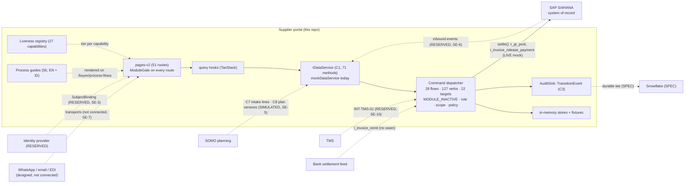

# Architecture — the portal in the federated landscape

**Status:** DRAFT for Seat 2 review · refreshed 2026-10-01 · from `main` @ `6f1da15aa41c03e38538562ea8e6c250353538a1` (PR #392).
**Tiers used below** (from `docs/contracts/README.md`): **LIVE** = code exists and runs (mock or in-memory); **RESERVED** = a named swap-point with no implementation; **SPEC** = a build target with zero code. The SE package that owns each integration is named (D1 §4).

---

## 1 · The systems

| System | Role | What the portal exchanges with it | Status in the tree | SE package |
|---|---|---|---|---|
| **Supplier portal (this repo)** | collaboration and orchestration layer; owns confirmations, declarations, uploads, reviews, forecast publications to suppliers, module activation, the audit trail | — | LIVE on fixtures | SE-4 |
| **SAP S/4HANA** | system of record for PO, GR, invoice, contract, scheduling agreement, vendor master, material master; owns the verbs the portal never fires | outbound: settlement of `t_gr_post` and `t_invoice_release_payment`; inbound: business events | outbound boundary LIVE (mock `settle`); inbound RESERVED, no seam code (C12 §5); document numbers never minted in the portal (C11 V15, gated) | SE-6, SE-12 |
| **SOMO (planning)** | emits demand, accepted requirements, plan versions, reorder point and safety stock | C7 intake lines → `intakeLine` machine → `t_pr_create`; C8 plan versions → `forecastPublication` machine → supplier responses; C9 material crosswalk | intake and publication machines LIVE on SIMULATED feeds (`src/services/planning/somoFixture.ts`, `src/services/data/mock/publicationFeed.ts`); `rop` / `safetyStock` / `projectedStock` SPEC (no producer); C9 zero rows | SE-5 |
| **TMS (transport)** | owns the shipment and ASN movement facts | `INT-TMS-01` ASN boundary | RESERVED (C5); `shipment` flow unwired | SE-10 |
| **Snowflake** | analytical layer | tee of the durable audit sink; curated datasets | SPEC (C4), zero code | not in the 21 packages |
| **Bank / settlement feed** | owns `t_invoice_remit` | — | no seam code (C12 §5) | SE-6 |
| **Messaging (WhatsApp BSP, email, EDI)** | supplier channels | outbound requests, inbound replies, reminders | every channel "Designed … (not connected)" (`src/data/communicationProfiles.ts`); an operator-fed inbound simulator at `/supplier/comm-hub`; no scheduler | SE-7, SE-19 |
| **Identity provider** | authenticates Paragon staff (Entra); supplier IdP unprocured (D-ID-2) | a `SubjectBinding` per person, nothing else | RESERVED (C5, C10) | SE-3 |
| **Object storage** | uploaded documents | file bytes behind `supplierDocument` | nothing stores bytes today | SE-8 |

**Two readings from the source documents, recorded as input rather than as fact.** The RFP Coverage Matrix v2 reads the landscape as hub-and-spoke on Snowflake; the tree does not implement it (C4 SPEC) and no contract ratifies it. The SE Handoff v1 names S/4 OData surfaces and a stack; none is referenced in the repository, and the Build Plan's FORK-6 leaves the stack to the SE Team. Both are open in D6.

## 2 · Diagram (Mermaid source)

---

## 3 · The seams, one paragraph each

**C5 — the seam register (`docs/contracts/C5-seams.md`).** The swap-points where the mock becomes the real system. `IDataService` behind `DataServiceContext.tsx` is LIVE (mock); `httpDataService` is RESERVED; `ICommandService` is LIVE in-memory; the SAP Option-B boundary is LIVE for two verbs; `AuditSink` is LIVE in-memory with the durable sink RESERVED; OIDC and `INT-TMS-01` are RESERVED; the backend datastore is RESERVED; Snowflake is SPEC. Two rows are wrong at the pin: LivenessRegistry is still "SPEC (named, no code)" although `src/services/liveness/registry.ts` exists with 27 capabilities, and the OIDC swap-point is still "persona→role map (`roles.ts`)" although `PERSONA_ROLES` is no longer the authorisation source. C5 also does not yet list the two read sub-services added since 25 September (`IPlanningService`, `IModuleService`). Corrections in D8 §2. Pinned by `pinReach.contract.test.ts` for its cited files, not for the tier column.

**C7 — purchase-requisition intake (`C7-pr-intake.md`, Amendment 1 2026-09-28).** One intake shape for two producers (the planning grid and SOMO). Since A2 an intake line is a machine: `intakeLine` (`Pending → Dismissed / Committed`, `t_intake_dismiss` / `_restore` / `_commit`, atom `pr:create`); commit cascades to `t_pr_create` with the line id as idempotency key, and `Committed` is terminal. The requisition carries its origin (`intakeLineId`, `periodBucket`, `decision`); the bucket is `month` or ISO `week` (`src/services/planning/bucket.ts`), quarters refused. `wasAdjusted` is derived by the dispatcher (`dispatcher.ts:492-495`) from the producer's baseline and is not a key any caller has. C7-FIND-02 and C7-FIND-05 are closed at A2; C7-FIND-03 (`shortfall`) stays open, pinned by `ledgerTruth.test.ts`. The document contradicts itself on C7-FIND-02 (D8 §5a).

**C8 — forecast publication (`C8-forecast-publication.md`, Amendment 1 2026-09-28).** The publication is a machine since B4a: `forecastPublication` (`Draft → Published → Superseded / Withdrawn`; `open`, `allocate`, `approve_firm`, `publish`, cascade `supersede`, `withdraw`); a revision is a new publication. Planners publish from `/buyer/plan-grid` (`PublicationPanel`, `PublicationLedger`); suppliers see deadline, version banner, net change against the superseded publication, and a dated receipt on `/supplier/forecasts`. Firm lines are signed under `publication:approve` (procurement) by a named actor. The `commitmentClass` projection is still UNRATIFIED: Amendment 1 says outright that it does not ratify it, and the period-global default (first bucket `firm`, later buckets `semi-firm`) is a policy default (`src/services/sdc/publication.ts:31-42`); C8-FIND-03's void `locked → firm` mapping is still flagged in `src/services/sdc/types.ts:23`. The plan-version feed is SIMULATED; the supplier read is LIVE-only by construction and shows the sample only when asked for it by name.

**The planning fact seam (`IPlanningService.getPlanningFacts`, B1; C6 governs).** Long-form facts (`materialCode`, `supplierId`, `periodBucket`, `measureId`, `value`, `uom`, provenance) over 15 registered measures (`src/services/planning/measures.ts`); `value: null` means "no figure", never zero. Two measures are editable: `acceptedQty` (through `t_intake_commit`) and `allocation` (through `t_publication_allocate`). C6 Amendment 1 / 1a (2026-09-28) moved the override baseline to the producer and made `wasAdjusted` derived; A1-R4 allows per-seat view state to persist while plan state never persists in the browser.

**Module activation (`IModuleService`, M1).** `getModuleActivation` (every seat; what is ON, derived from the ledger, no attribution) and `getModuleLedger` (buyer only; the acts with who and why). The verb is `t_module_set` (atom `module:set`, compliance lane). No contract document covers this seam beyond C1's method list; Design 5 Part A is its specification.

**C9 — material master crosswalk.** Schema and types only: zero rows, zero consumers; thirteen self-declared non-conformances, twelve open. The material master is the frozen `MATERIAL_MASTER` (`src/services/sdc/fixtures.ts:135`, 42 codes). Ratification is SOMO's. Unchanged since the previous issue.

**C10 — identity, authority and approval.** Unchanged since Amendment 1 (2026-09-24); blob `42e23239…` at both pins. Amendment 1 discharged §8.2 and §8.3 in code and closed §8.6; §6.3a governs sample persons. Still open: §8.1 (the six-object model is unbuilt), §8.7, §8.8, D-ID-2, D-ID-5. Stale text, uncorrected at the pin: the header's "ZERO CODE. ZERO TYPES. ZERO FIXTURE PERSONS.", §8.5 (`PERSONA_ROLES` as the authorisation object) and §8.4 ("It does not": `TransitionEvent` does carry an optional `attribution`, filled from the session on user-trigger transitions, `dispatcher.ts:472`). See D8 §3. No test pins C10.

**C11 — invariant pointer.** V15 (the portal never mints a document identity) is now `GATE`, enforced by `src/lib/documentNumberGate/documentNumberGate.test.ts` (PR #392). V16 and V17 remain `NOT ENFORCED`.

**C12 — the backend spec.** A map of what is absent per seam, the never-build rules, inherited invariants, the idempotency contract and the seam-code gap. §2.1's V15 paragraph was rewritten at #392 ("used to violate … retired … gated"). One sentence in §1 is still false: "C3 has no pin and no reader" (D8 §4).

---

## 4 · Data flow for one act (what the backend reproduces)

A planner commits an accepted quantity from the planning grid:

1. `PlanGrid` / `TimePhasedGrid` (`src/pages-v2/plan-grid/`) holds the typed or pasted value in a PLANNED overlay (React state, `PlanDraftProvider.tsx`); a reason is required when it differs from the producer's baseline.
2. Push calls `useIntakeCommit` (`src/services/query/commandHooks.ts`) once per row; the first dispatch's `correlationId` becomes the `causationId` of the rest.
3. The dispatcher checks the module (`PLN` for the intake line; `REQ` again for the cascaded create, `src/services/modules/registry.ts:175-182`), the seat's atoms (`pr:create`), tenancy, `expectedState`, legality (`Pending`), payload attribution keys, required fields, then the `INTAKE_*` hooks, and derives `decision.wasAdjusted`.
4. `intakeLineTarget` marks the line `Committed`; the cascade dispatches `t_pr_create` with `idempotencyKey = line.id`, and the requisition store mints the requisition with its origin.
5. Two `TransitionEvent`s are emitted (the commit and the cascaded create), linked by `causationId`.
6. The hook invalidates the scoped query keys; the grid and `/buyer/purchase-requisition` re-read through `IDataService`.

The backend replaces steps 3 to 6 behind the same `IDataService` shape: a durable store, a durable sink, server-side scoping (`describeScopingConformance`, `src/services/contracts/conformance/scoping.ts`) and the same refusal order (`describeDispatchConformance`, `conformance/dispatch.ts`). Both factories are runnable against the real service. The overlay in step 1 becoming a durable plan draft is SE-18 (Design 1 §6).

---

## 5 · What is not in this picture

- No AG Grid (SE-1) and none of the Excel-grade grid features (SE-14); the grid on `main` is read-only views plus governed edits.
- No co-pilot, document intelligence or agents; the guides are ready for one (SE-20).
- No Flow Builder (SE-16); flows are code.
- No spend classification, should-cost engine or risk feed; `commodityIntel` is SIMULATED on vendored baskets.
- No export or download primitive anywhere in `src/` (no `Blob`, no `createObjectURL`); every export control says so (SE-9).
- No durable plan draft and no persisted module ledger (SE-18, SE-4).
