# R3 · State-machine completeness (Q3) · Flow Builder foundation (Q4) · Promotion path (Q4-addendum 2)

**Pinned:** `main` @ `81c98403a83a674df80959f7d2290898ddd822fa` (merge of PR #376, 2026-09-28 07:27 +07). Read from a `git archive` export in Seat 3's scratchpad; every path below is relative to that export. Nothing was written into the repository; the sibling was never opened. Seat 3, consultant, Ops Project #11. 2026-09-28.

> ⚠️ **CORRECTION APPLIED BEFORE DELIVERY — ONE FINDING RETRACTED, AND THE INSTRUMENT'S BLIND SPOT NAMED.** The census script resolved three non-literal dispatch sources (`headerVerbFor`, the cascade fan-out, the delivery service) and **missed a fourth**: `useRequirementResponseCommand(transitionId)` in `src/services/query/sdcBuyerHooks.ts:186-204`, which dispatches `t_requirementresponse_review / accept / dispute / resolve` (`:307 / :318 / :332 / :252`) from `BuyerCollaboration.tsx:367-369, 350`. Derived by `grep -rn "transitionId,"` over `src/` (the variable form, not the quoted literal): the full set of non-literal sources is `commandHooks.ts:655` (GR header verb), `MockCommandService.ts:2520-2592` (cascade fan-out), `sdcBuyerHooks.ts:204` and `sdcSupplierHooks.ts:420`. **Measured in the browser** (R2 §A, screen `Q2_09`): "Start review" on `/buyer/collaboration` dispatches `t_requirementresponse_review` — toast *"Under review — RM-EMUL-3310"*, the row moves to Accept / Dispute; "Resolve" opens the required-answer dialog for `t_requirementresponse_resolve`. So the four buyer SDC verbs are **DISPATCHED-NON-LITERAL**, not `WIRED-NO-CALLER`, and the original finding 3 ("the supplier's response strands at `Submitted`") is **false and is retracted rather than softened** (`FALSE-MECHANISM-MUST-NOT-BE-FILED-01`). Appendix A is left verbatim as the instrument printed it; every place in the body that read off those four rows is corrected below and says so. The totals line in App. A therefore over-counts `WIRED-NO-CALLER` by four and under-counts `DISPATCHED-NON-LITERAL` by four — **5 and 7** respectively after resolving the fourth source (arithmetic on the appendix rows, not a fresh census). The bilateral control (`t_gr_approve` / `t_gr_hold`) still held, which is the lesson: a control on ONE non-literal source cannot see a SECOND — `RESOLVE-NON-LITERAL-IDS-01` says derive the sources, and this instrument listed them.

**Instrument:** one read-only vite-node script (`scratchpad/r3census.ts`) run over the export with `node_modules` from the export's own `npm ci`. It imports the seeded barrel (`src/services/transitions/index.ts`), the analyzer (`flowGraph.ts`), the census (`looseEndCensus.ts`), `WIRED_COMMAND_TARGETS` and every entity store, and — for the in-flight table — runs the same five seed functions `src/main.tsx:55-121` runs before the app renders. Its full output is pasted verbatim in **Appendix A**; every count in this document is read from there, never restated by hand.

**Bilateral control on the instrument (Appendix A, `=== CONTROL ===`):** `t_gr_post` is registered · `t_gr_approve` classifies `DISPATCHED-NON-LITERAL` (fired through `headerVerbFor` in `grRollup.ts:61-68`, dispatched at `commandHooks.ts:655`) · `t_gr_hold` classifies `WIRED-NO-CALLER`. Both halves of the control hold, so the classifier is looking at the tree and not at itself.

**What was measured at runtime vs read:** the flow/state/transition census, the loose-end derivation, the atom lattice, the cascade table and the per-state fixture occupancy are RUNTIME (script). The surface-reachability of each dispatch call site is a SOURCE walk inside the same script (literal `transitionId:` sites → enclosing hook/method → callers → `pages-v2`/`components`), with three non-literal sources resolved by hand from source (`grRollup.ts:61-68`, the cascade fan-out `MockCommandService.ts:2520-2592`, the delivery service methods `MockDeliveryService.ts:132/209/239` → `deliveryHooks.ts:57/124/176/222` → `BuyerContractDetail.tsx`) — **and a fourth missed** (`sdcBuyerHooks.ts:204`), corrected in the header above. Everything in Q3(c) and the promotion path is READ.

---

## 0 · The ten things a reader should take from this file

| # | Finding | Impact | Where |
|---|---|---|---|
| 1 | **The catalog is 25 flows · 103 states · 115 transitions, and 27 transitions (23%) sit on 6 flows that have no CommandTarget and can never fire**: `goodsReceiptLine`, `invoiceMatch`, `shipment`, `contract`, `obligation`, `compliance`. Two are substrate by design; **`contract` and `compliance` are lanes the product advertises.** | P1 | §1.2, App. A totals |
| 2 | **Every hand-off from sourcing into a contract or scheduling agreement is NOTHING.** Award → contract: no verb, no cascade; `BuyerContracts.tsx` mints a `CTR-…` number client-side (C11 V15, `CTR-FABRICATION-01`). Contract → scheduling agreement: fixture link only (`SchedulingAgreement.contractId`), no creation verb (`deliveryRelease#initial-integrity#Draft` is censused). | P1 | §2.1 |
| 3 | ~~The supplier's requirement response strands at `Submitted`.~~ **RETRACTED** (see the correction in the header): the four buyer verbs are dispatched non-literally via `useRequirementResponseCommand` (`sdcBuyerHooks.ts:186-204`) from `BuyerCollaboration.tsx`, and "Start review" was measured firing in the browser (R2 §A). The planner's review loop is BUILT-E2E; what the SDC lane lacks is a **publish** act, a **chase/ask** act, a supplier exit from `Disputed`, and a supplier call-off acknowledgement — all in R2 §4. Kept in this table so the retraction is visible. | — | R2 |
| 4 | **Payment is a one-way door.** `t_invoice_remit` (bank, external) has no caller and no settle path; 5 fixture invoices rest in `Payment Released`, the state before the machine's only terminal. Correct as a seam, but nothing renders "awaiting remittance" as an external wait — verify against `nextAct.ts`. | P2 | §2.1 |
| 5 | **The state machine is structurally clean where it is declared**: 0 unreachable states, 0 dead transitions, 0 orphan cascades, every one of the 11 derived loose ends is censused and no census row is stale. The `looseEndCensus.ts` header says **NINE** rows; the derivation returns **11**. `FLOOR-IN-PROSE-01`, inside the census that exists to prevent it. | P3 | §1.4 |
| 6 | **Five wired verbs no surface fires** (`WIRED-NO-CALLER`, corrected from the appendix's nine — see header): `t_po_view`, `t_gr_hold`, `t_rfq_close`, `t_pr_convert`, `t_psl_cap_set`; plus `t_enforcement_set` whose only caller is a seed. Three are by ruling (computed / ruled-unsurfaced); `t_po_view` and `t_gr_hold` are backlog the surface census (`surfaceable.test.ts:243-266`) already flags. | P2 | §1.3 |
| 7 | **All 12 atoms held by no lane are the automation grant, and nothing else is unheld** — 80 atoms, 68 on lanes, 12 automation-only, 0 orphans, 0 decorative lane atoms. The role lattice is sound. | ✔ | §1.5 |
| 8 | **Missing processes:** returns-to-vendor / RTV, credit & debit notes, quality notification (NCR), supplier block/offboard, contract amendment, price change, claims, consignment, subcontracting, service entry — none modelled; each ruled OURS / SAP / SE-SCOPE in §3 with the reason. Only `goodsReceiptLine.t_grline_return` gestures at a return, and it is substrate. | P2 | §3 |
| 9 | **A Flow Builder can render everything from the registry today except four things the registry does not carry:** layout (computed by BFS at render, `flowLayout.ts:141`), state labels (raw strings, no i18n map anywhere), policy-hook descriptions/parameters (names only, `policyHooks.ts:30`), and flow grouping/order (registration order in `index.ts`). Role names, purposes, step kinds and owners are already keyed. | — | §4.3 |
| 10 | **Promotion ("draft takes over the default") is a code change today, not data.** The dispatcher resolves every verb through the process-wide singleton (`dispatcher.ts:38,439`), no event or DTO carries a flow version (`events.ts` `TransitionEvent`, grep in §5.b), and the catalog is pinned by three bilateral gates plus C1. Recommend (i) generated, reviewed code; a runtime catalog is a Stage-F backend item. In-flight documents at the moment of a swap: **202 seeded documents across 15 stores** (table §5.c; the four ledgers hold no documents). | — | §5 |

---

## 1 · Q3(a) — the machine, derived

### 1.1 Shape of the registry

`FlowDefinition` (`src/services/transitions/schema.ts`, interface `FlowDefinition`): `entity`, `states[]`, `initial`, `terminals[]` (required; `[]` legal), `transitions[]`, `version`.
`TransitionDef` (same file): `id` (`t_<entity>_<verb>`, format-validated `validate.ts:15`), `from[]`, `to`, `trigger` (`user | system | cascade | creation`; `clock` is a compile error, `schema.ts` `ClockTriggerIsForbidden`), `surfaceable` (`{surfaced:true}` | `{surfaced:false, because:'external-fact', owner:'s4hana'|'tms'|'bank', why}` | `{surfaced:false, because:'computed'|'ruled-unsurfaced', why}`), `requiredRole` (one atom, `<ns>:<verb>`), `requiredFields[]`, `policyHooks[]` (names, resolved by the dispatcher), `sapBoundary?`, `settlesTo?` (required iff `sapBoundary`), `statePreserving?`, `version`.

Registration: `flowRegistry.register(flow)` runs `assertValidFlow` and refuses a duplicate entity or transition id (`registry.ts`, class `FlowRegistry.register`). The 25 flows self-register at import of the barrel (`index.ts`, the `flowRegistry.register(...)` block). Cascades are NOT in the flow: `CASCADES` (`cascades.ts:25-62`) maps 5 source ids to 6 links.

### 1.2 Per-flow totals (Appendix A, `=== PER-FLOW TOTALS ===`, verbatim)

```
flows: 25 transitions: 115 states: 103
wired targets: purchaseOrder,advanceShipNotice,goodsReceipt,invoice,rfq,quotation,purchaseRequisition,requirementResponse,inventoryDeclaration,incomingShipment,enforcement,role,supplierDocument,supplierApplication,materialRequest,psl,pslCapSetting,deliveryRelease,deliveryPolicy
target-less flows: goodsReceiptLine,invoiceMatch,shipment,contract,obligation,compliance
TOTALS: {"EXTERNAL-FACT":7,"WIRED-NO-CALLER":9,"DISPATCHED-BY-SURFACE":63,"CASCADE-ONLY":5,"DISPATCHED-NON-LITERAL":3,"AUTHORED-UNWIRED":27,"SEED-ONLY-CALLER":1}
```

Classification key (first matching rule wins): `DEAD` = analyzer `dead-transition` (0 today) → `AUTHORED-UNWIRED` = flow has no CommandTarget → `DISPATCHED-BY-SURFACE` = a literal call site reachable from `pages-v2`/`components` → `DISPATCHED-NON-LITERAL` = fired via `headerVerbFor` → `CASCADE-ONLY` = only the fan-out names it → `HOOK-NO-SURFACE` = literal site with no page caller (0 after resolving the delivery service) → `EXTERNAL-FACT` = `surfaceable.because === 'external-fact'` and no caller → `SEED-ONLY-CALLER` → `WIRED-NO-CALLER`.

19 of 25 flows are wired (matches C1 `docs/contracts/C1-methods.md:1-4`: 66 · 115 · 19). The full per-transition table (id, from→to, trigger, surfaceable, atom, lanes holding it, required fields, hooks, flags, cascades, class, call site, surface) is Appendix A `=== PER-FLOW TRANSITION TABLE ===`.

### 1.3 The transitions that need a decision (from App. A, `SEED-ONLY / HOOK-NO-SURFACE detail`)

| id | class | `surfaceable` | Reading |
|---|---|---|---|
| `t_po_view` | WIRED-NO-CALLER | yes | Supplier "viewed" fact; `surfaceable.test.ts:358` already censuses it. Either a read-side stamp fires it or it is `computed`. Decide. |
| `t_gr_hold` | WIRED-NO-CALLER | yes | Quality hold is offered nowhere; `t_gr_request_retest` (the exit) IS surfaced at `BuyerGoodsReceipt.tsx`. A resume without a hold. `surfaceable.test.ts:266` flags it. |
| `t_rfq_close` | WIRED-NO-CALLER | no: computed | Deadline elapsing — a clock fact; law 0.5 forbids a clock trigger, so it can only be fired by a person or a job. Today `Open` RFQs (8 fixtures) go straight to award. |
| `t_pr_convert` | WIRED-NO-CALLER (+ censused `unauthored-cascade`) | no: computed | PO is an S/4 fact (F2). Censused by ruling (`looseEndCensus.ts` row `purchaseRequisition#unauthored-cascade#t_pr_convert`). |
| `t_requirementresponse_review / accept / dispute / resolve` | ~~WIRED-NO-CALLER ×4~~ **DISPATCHED-NON-LITERAL ×4** (corrected) | yes ×4 | `useRequirementResponseCommand(transitionId)` (`sdcBuyerHooks.ts:186-204`) ← `BuyerCollaboration.tsx:350, 367-369`; browser-measured (R2 §A). No decision needed here; the SDC decisions are in R2. |
| `t_enforcement_set` | SEED-ONLY-CALLER | no: ruled-unsurfaced | Fired only by `enforcementSeed.ts:163`. Operator cannot change an enforcement mode from any surface. |
| `t_psl_cap_set` | WIRED-NO-CALLER | no: ruled-unsurfaced | Portal-wide validity cap; no caller at all, not even a seed. The cap in force is the compiled default (`pslCapSettingStore.ts:47-59`). |
| `t_invoice_remit` | EXTERNAL-FACT | no: bank | No caller, no `settle` path (grep `t_invoice_remit` in `MockCommandService.ts` and `services/query/*` → none). 5 fixtures rest one state before terminal. |

### 1.4 Structural integrity (App. A `=== LOOSE ENDS ===`)

Derived loose ends: **11**, all `[censused]`; `census rows with no derived end: none`. By kind: 8 × `initial-integrity` (no creation verb — `goodsReceiptLine`, `invoiceMatch`, `compliance`, `enforcement`, `role`, `pslCapSetting`, `deliveryRelease`, `deliveryPolicy`), 2 × `exit-less-state` (`invoiceMatch` `Qty Mismatch`, `Price Variance`), 1 × `unauthored-cascade` (`t_pr_convert`). **0 unreachable states, 0 dead transitions.** Every SAP-boundary interim state has its settlement edge declared (`settlesTo`), so `Posting to SAP` / `Releasing Payment` are neither unreachable nor exit-less.

⚠️ `looseEndCensus.ts`'s doc-comment (`/** THE CENSUS. **NINE rows — down from EIGHTEEN at PF-0** …`) is stale by two: the delivery-lane rows (`deliveryRelease`, `deliveryPolicy`) joined it without the sentence moving. The gate (`flowGraph.test.ts` "every CENSUS entry is still a loose end") guards membership, not the prose. Fix: delete the number.

**The dead-end question the §48g derivation asked** ("non-terminal states no surface can leave") is a different instrument from the analyzer: the analyzer asks whether an EDGE exists, §48g asks whether a DISPATCHED edge exists. Folding the classification in: a state is a practical dead end when every exit is `WIRED-NO-CALLER`, `AUTHORED-UNWIRED` or an `EXTERNAL-FACT` with no feed. From App. A's state table, the wired flows' practical dead ends today are:

| flow | state | why it is a dead end in practice | docs resting there |
|---|---|---|---|
| purchaseOrder | `Confirmed`, `Partially Delivered`, `Delivered` | every exit is an S/4 goods-movement fact (`t_po_partial_deliver / deliver / close`), no feed | 3 + 2 + 5 |
| advanceShipNotice | `Submitted`, `In Transit` | exits are TMS facts (`t_asn_in_transit / deliver`) or the GR cascade | 0 + 2 |
| advanceShipNotice | `Delivered` | only exit is the discrepancy cascade; no terminal declared (`terminals: []`) | 2 |
| invoice | `Payment Released` | only exit is `t_invoice_remit` (bank, no caller) | 5 |
| invoice | `Submitted` (when match verdict ≠ Matched) | `t_invoice_match` cascade no-ops on variance; the only human exit is `t_invoice_dispute` — a variance that nobody disputes sits forever | 4 |
| rfq | `Open` | `t_rfq_close` has no caller; award is the only human exit, so an RFQ nobody awards never closes | 8 |
| ~~requirementResponse~~ | ~~`Submitted`~~ | **struck (corrected):** `t_requirementresponse_review` is dispatched from `BuyerCollaboration.tsx` — not a dead end. The RR machine's real structural gap is the other way round: **a supplier has no exit from `Disputed`** (only the buyer's `resolve`), measured in R2 probe A. | 3 |
| purchaseRequisition | `Approved`, `Sourcing Event` | `t_pr_convert` unauthored by ruling; `Approved` also exits via `t_pr_source` **only** when an RFQ is raised from it | 1 + 1 |

The first three rows are seams (correct, awaiting F2/TMS feeds); `nextAct.ts:165` is the instrument that must render them as "awaiting S/4HANA / TMS" — its tests say it does for `Confirmed` (`nextAct.test.ts` "a PO in Confirmed names S/4HANA"). The last four rows are product gaps.

### 1.5 Atoms and lanes (App. A `=== ATOMS ===`)

```
atoms in catalog: 80
atoms held by NO lane: po:issue(automation), po:fulfil(automation), po:close(automation), asn:carry(automation), invoice:match(automation), rfq:close(automation), quotation:award(automation), quotation:reject(automation), shipment:create(automation), shipment:advance(automation), pr:source(automation), pr:convert(automation)
lane atoms that no transition requires: none
automation atoms not required by any transition: none
```

Lanes are the 11 non-superset members of `SystemRoleId` (`businessRoles.ts:133-146`; `admin` and `buyer_all` excluded as `SUPERSET_ROLES`, `:817`). `AUTOMATION_ATOMS` (`:663-682`) is exactly the 12 above plus `asn:flag`, `invoice:pay`, `compliance:verify`, `compliance:reject`, which ARE also on a lane (receiving / finance / compliance) — the `invoice:pay` collision the file itself flags (`:655-660`: `t_invoice_release_payment` human and `t_invoice_remit` bank share one atom). **Nothing is held by nobody.**

Policy hooks attached to transitions that never fire today: `enforcement_set_governed`, `psl_default_cap_within_ceiling` (`rr_dispute_text_authored` was listed here by the appendix and is struck — its two verbs are dispatched, see header). Cascades whose target is unwired: **none** (all 6 links target wired, registered transitions — App. A `=== CASCADES ===`).

### 1.6 Verbs a surface shows but cannot dispatch

Two instruments, neither mine, and both are bilateral ratchets:
- `deadAffordance.guard.test.tsx:475-522` — **30 residue rows**, every one a control with no handler or a handler that does nothing: `BuyerOrders` `newPo` / `export` / `bulkDownload` / dynamic footer action; `BuyerRequisitions` `export` / `bulkDownload`; `BuyerSuppliers` `bulkUpload` / `bulkDownload` / `export` / `invite`; `BuyerSupplierProfile` `message` / `createRfq` / comm save+reset; `SupplierStorefront` `connect` / `requestRfq` / `requestQuote` / contact send+draft; `Marketplace` `rfq.viewAll`; `TopBarV2` `toggleNav` / `notifications`; `SupplierWhatsApp` `Unsubscribe`; `Login` `Forgot password?`; `BuyerSourcing` / `BuyerContracts` `export` + `templates` (ruled §103h). 18 rows are `UNRULED`.
- `surfaceable.test.ts:243-266` — the census of verbs declared `surfaced: true` that no surface fires. Members today, from my classification (corrected — the four `requirementResponse` buyer verbs are dispatched, see header): `t_po_view`, `t_gr_hold`; and on unwired flows: 6 × `goodsReceiptLine`, 2 × `obligation`, `t_compliance_submit`.

Note the two instruments look in opposite directions: the first finds a button with no verb; the second finds a verb with no button. A `newPo` button on `BuyerOrders` is exactly the first kind and it is unruled — the operator's ruling that a PO is raised in S/4 settles it: delete the button.

---

## 2 · Q3(b) — end to end, as one source-to-pay process

### 2.1 Hand-offs between flows

| From → To | Mechanism today | Evidence | Verdict |
|---|---|---|---|
| SOMO plan / Intake Review → PR | **human verb** `t_pr_create`, dispatched from `IntakeAdjustDrawer.tsx`, `IntakeReview.tsx`, `BuyerRequisitions.tsx` | App. A row `t_pr_create`; C7 `docs/contracts/C7-pr-intake.md:131,160-162` | works; C7-FIND-05 (`:286`) — no idempotency at the intake, a redelivered SOMO event mints a duplicate |
| PR (`Approved`) → RFQ | **human verb** `t_rfq_create` with optional `sourceRequisitionId` → **cascade** `t_pr_source` | `cascades.ts:55`; resolver `MockCommandService.ts:2558-2559` | works when raised from the PR; an RFQ raised without the id cascades onto nothing (ordinary path) |
| PR → PO | **NOTHING** (`t_pr_convert` unauthored by ruling — PO is an S/4 fact, F2) | `looseEndCensus.ts` row; `cascades.ts:40-50` comment | seam; `Approved` PRs strand until F2 |
| RFQ award → quotations | **cascade** ×2 (`t_quotation_award` winner, `t_quotation_reject` losers) | `cascades.ts:58-61`; resolver `:2587-2592` | works |
| Award → contract | **NOTHING.** `contract` flow is inert (no target); its 4 verbs are S/4 facts (`external-fact:s4hana`); `BuyerContracts.tsx` mints a `CTR-…` number client-side | App. A `contract` rows; C11 V15 `docs/contracts/C11-invariants.md:72` | **gap + fabrication** (`CTR-FABRICATION-01`) |
| Award → PSL | **NOTHING automatic**; `t_psl_propose` is a separate human verb | App. A `psl` rows | fine — PSL is governance, not a consequence of one award |
| Contract → scheduling agreement (delivery lane) | **fixture link** `SchedulingAgreement.contractId` (`services/delivery/types.ts:252-256`); no creation verb — `deliveryRelease#initial-integrity#Draft` censused | App. A loose ends; `MockCommandService.ts:2283-2300` | agreement exists because the fixture says so; SAP LPA is the owner (ruling: call-off is the SAP release) |
| Scheduling agreement → call-off / PO | **human verbs** `t_delivery_release` (Draft→Released), `t_delivery_adjust`, `t_delivery_confirm` (match against the supplier's shipment pool, `deliveryShipmentPoolFor`, `:2345`) — all from `BuyerContractDetail.tsx` | App. A; `MockDeliveryService.ts:132-260` | works; but a released line creates **no PO object** — by ruling the release IS the SAP document |
| PO → acknowledgement / confirmation | **human verbs** `t_po_acknowledge`, `t_po_confirm` (supplier, `SupplierOrders.tsx`) with policy `po_confirm_qty_within_ordered` | App. A | works; no "change request" verb exists (a supplier who cannot meet the PO can only under-confirm) |
| PO → ASN | **human verb** `t_asn_create` (`poReference`, policy `asn_create_po_confirmed`) → `t_asn_submit` | App. A; `MockCommandService.ts:183-213` | works |
| ASN → shipment (TMS legs) | **NOTHING** — `shipment` flow inert, all 8 verbs `external-fact:tms` | App. A | seam (INT-TMS-01) |
| ASN in transit / delivered | **external facts** `t_asn_in_transit`, `t_asn_deliver` (tms), no feed | App. A | seam |
| Supplier incoming shipment (SDC) → ASN | **policy link only** `ish_toparagon_asn_linked` | App. A row `t_incomingshipment_report` | a check, not a hand-off; the two objects never converge |
| ASN → GR | **human verb** `t_gr_create` (`asnReference`, policies `gr_create_shipment_received`, `gr_inspection_materials_declared`) from `GRInspectionWizard.tsx` | `MockCommandService.ts:264-334` | works; the wizard also runs `verifyHalalAtReceipt` (tells, does not stop) |
| GR disposition → ASN discrepancy | **cascade** on `t_gr_reject` / `t_gr_partial_approve` | `cascades.ts:26-31` | works; resolved by `t_asn_resolve_discrepancy` (`BuyerGoodsReceipt.tsx`) |
| GR → quality hold → return | `t_gr_hold` no caller; `t_grline_return` substrate | §1.3 | **gap**: no hold entrance, no return-to-vendor object |
| GR post → invoice match | **SAP boundary** `t_gr_post` (settles to `Posted to SAP`) → **cascade** `t_invoice_match` fired only on a genuine `Matched` verdict; variance no-ops and writes `matchStatus` | `cascades.ts:37-39`; `invoiceRollup.ts:33-53` | works; variance leaves the invoice in `Submitted` (see §1.4) |
| PO → invoice | **human verb** `t_invoice_create` (`poReference`, policy `invoice_create_po_confirmed`) by supplier | `MockCommandService.ts:388-455` | works |
| Invoice → dispute / resolve | **human verbs** `t_invoice_dispute`, `t_invoice_resolve` (finance) | App. A | works; no credit/debit note object results |
| Invoice → payment | **SAP boundary** `t_invoice_release_payment` (settles to `Payment Released`) → **external fact** `t_invoice_remit` (bank), no caller | App. A | seam; SE handoff `:262` says payment status is read from SAP FI |
| Supplier registration (`/register`) → application | **NOTHING** — page holds `useState` only (arc 3, CLAUDE.md); a BUYER raises `t_application_submit` | App. A `supplierApplication` rows | one-sided |
| Application approved → supplier master / vendor | **NOTHING** — approve stamps `decidedAt/decidedBy` only | `MockCommandService.ts:1771-1773` | **gap** (vendor master is SAP's — RFP §8 "master-data write-back") |
| Supplier document verified → compliance cell | **NOTHING** — `supplierDocument` (wired, 5 verbs) and `compliance` (inert, 3 verbs) are two vocabularies; `BuyerCompliance` reads the registry projection | App. A | the canonical machine cannot fire; the document lane can |
| Material request approved → material master / RFQ | **NOTHING** — approve stamps `decidedAt/decidedBy`; `materialrequest_rfq_resolved` only checks the RFQ exists | `MockCommandService.ts:1901-1903` | by design ("mints no code"); the hand-off to SAP MM is SE-scope |
| Performance / scorecard | no flow, no verb; fixture reads | `BuyerScorecard.tsx`, `SupplierPerformance.tsx` | read-only surface; nothing to strand |
| Governance (enforcement / role / PSL cap / drawdown policy) | 4 single-state ledgers, `statePreserving` | App. A | correct shape; two of the four have no surface caller (§1.3) |

### 2.2 The chain as it stands (Mermaid)

```mermaid
flowchart LR
  classDef gap stroke-dasharray: 5 5,stroke:#b00,color:#b00
  classDef inert fill:#eee,stroke:#999,color:#666
  classDef seam stroke:#0097A7,stroke-dasharray: 2 2

  INTAKE[SOMO plan / Intake Review<br/>fixture + drawer]
  PR[purchaseRequisition<br/>wired · 7 verbs]
  RFQ[rfq<br/>wired · 7]
  QUO[quotation<br/>wired · 4]
  PSL[psl<br/>wired · 8]
  CTR[contract<br/>INERT · 4 S/4 facts]:::inert
  SA[deliveryRelease + deliveryPolicy<br/>wired · 4 · fixture-born]
  PO[purchaseOrder<br/>wired · 7 · born from S/4]
  ASN[advanceShipNotice<br/>wired · 6]
  SHP[shipment<br/>INERT · 8 TMS facts]:::inert
  ISH[incomingShipment SDC<br/>wired · 4]
  GR[goodsReceipt<br/>wired · 8]
  GRL[goodsReceiptLine<br/>substrate]:::inert
  INV[invoice<br/>wired · 8]
  INVM[invoiceMatch<br/>substrate]:::inert
  PAY[(Payment Released<br/>→ remit: bank, no feed)]:::seam
  APP[supplierApplication<br/>wired · 4]
  DOC[supplierDocument<br/>wired · 5]
  CMP[compliance<br/>INERT · 3]:::inert
  MR[materialRequest<br/>wired · 4]
  RR[requirementResponse SDC<br/>wired · 7 · both halves dispatched<br/>no publish act, no supplier exit from Disputed]
  INVD[inventoryDeclaration<br/>wired · 2]

  INTAKE -- "human t_pr_create" --> PR
  PR -- "human t_rfq_create + cascade t_pr_source" --> RFQ
  PR -. "GAP: t_pr_convert unauthored (S/4 fact, F2)" .-> PO
  RFQ -- "cascade award/reject" --> QUO
  QUO -. "GAP: no verb, CTR minted client-side" .-> CTR
  CTR -. "fixture contractId only" .-> SA
  SA -. "GAP: release creates no PO (SAP release by ruling)" .-> PO
  PO -- "human t_asn_create (poReference)" --> ASN
  ASN -. "GAP: TMS legs inert" .-> SHP
  ISH -. "policy link only" .-> ASN
  ASN -- "human t_gr_create (asnReference)" --> GR
  GR -- "cascade t_asn_discrepancy" --> ASN
  GR -. "rollup only" .-> GRL
  GR -- "SAP post → cascade t_invoice_match (Matched only)" --> INV
  PO -- "human t_invoice_create (poReference)" --> INV
  INV -. "rollup only" .-> INVM
  INV -- "SAP boundary release_payment" --> PAY
  APP -. "GAP: approve writes no vendor" .-> PO
  DOC -. "GAP: two vocabularies, no link" .-> CMP
  MR -. "GAP: approve mints nothing (by design)" .-> RFQ
  RR -. "GAP: review/accept/dispute have no caller" .-> INTAKE
  INVD -. "read by planner only" .-> INTAKE
  PSL -. "informs sourcing gate" .-> RFQ
```



Solid = a mechanism exists and is dispatched. Dashed red = nothing or a fixture link. Grey = inert flow.

### 2.3 Can a document strand?

Yes, in five places that are not seams (six before the correction in the header struck `requirementResponse Submitted`) — §1.4 rows for `invoice Submitted (variance)`, `rfq Open`, `purchaseRequisition Approved / Sourcing Event`, plus `advanceShipNotice Delivered` (a flow with `terminals: []`, so a delivered ASN is by declaration never finished) and `goodsReceipt Under Inspection` if a receipt needs a hold (no entrance). The seams (`PO Confirmed…Delivered`, `ASN Submitted/In Transit`, `invoice Payment Released`) are correct and must be RENDERED as waits, which `nextAct.ts` does for the PO case; whether it does for `Payment Released` I did not measure.

---

## 3 · Q3(c) — what a complete procurement platform has that this tree does not

Operator rulings applied: SOMO owns planning, demand and ROP; SAP owns documents and numbers; the call-off is the SAP release. `docs/Paragon_Platform_Strategic_Spine_v1.md` does not rule on any of the processes below (grep for returns / credit / claim / offboard / amendment / consignment / subcontract / service entry returns nothing). The RFP asked for none of them by name except payment visibility (Functional #5) and master-data write-back (matrix §8, `SCH_RFP_Coverage_Matrix_v2.md:224-226`).

| Process | Status in tree | Verdict | Reason |
|---|---|---|---|
| Returns to vendor (RTV) / return delivery | `t_grline_return` exists on the substrate line flow only; no header verb, no object, no supplier-side notice | **SAP** document (return delivery / 122 movement) · **OURS** the supplier-facing notice and the reason code | The movement and the number are S/4's by ruling; what the supplier sees is ours and is absent |
| Credit / debit notes | none; a dispute resolves back to `Submitted` | **SAP** (FI document) · **OURS** the supplier-visible outcome of a dispute | Dispute resolution today has no financial artefact; the supplier learns nothing |
| Quality notification / NCR / CAPA | none; `Quality Hold` has no entrance; no notification object | **OURS** (portal object) with **SAP** QM as optional source | The RFP's control-tower row (#7) implies exceptions; a hold with no notification is not a process |
| Supplier block / offboarding / suspension | none; `supplierApplication` has approve/reject only; PSL `Withdrawn` is per listing | **OURS** status + **SAP** vendor block flag | SE handoff `:242` promises PO auto-block on expired certification; there is no block state anywhere |
| Contract amendments / renewals | `contract` flow inert; `t_contract_renew` is an S/4 fact | **SAP** by ruling · **OURS** the obligation/commitment view (`obligation` flow, inert) | Two inert flows; the surface mints its own numbers |
| Price changes (info record / condition changes) | none | **SAP** | Price is SAP's; the portal would only read |
| Claims / penalties / chargebacks (OTIF) | none; scorecard is fixture | **OURS** proposal, **SAP** settlement | RFP #8 tiering implies consequences; none modelled |
| Consignment / VMI stock | `inventoryDeclaration` is a supplier SOH snapshot, not consignment | **SE-SCOPE** (decide with SOMO) | Depends on the distributor/principal model the RFP §8 says nothing has |
| Subcontracting (components provided) | none | **SAP** | Out of RFP scope |
| Service entry sheets | none | **SAP** | Portal is RM/PM (C7 §0) |
| Scheduling-agreement releases (call-offs) | `deliveryRelease` wired, 3 verbs surfaced | **built** (portal side) · **SAP** owns the release document | The release creates no PO and that is the ruling |
| Invoice payment status / remittance | `t_invoice_remit` external, no feed; `Payment Released` renders? (not measured) | **SAP FI → OURS read** | SE handoff `:262`; needs F1 |
| Supplier master change (self-service → approval → SAP write) | none | **OURS** workflow · **SAP** write-back | RFP §8 names it explicitly as a workflow, not a sync |
| Catalogue / punch-out | `Marketplace` + storefront UI-only (dead affordances `requestQuote`, `requestRfq`) | **SE-SCOPE** | Not in the RFP's functional scope |
| Supplier self-registration write path | `/register` is `useState` only | **OURS** (arc 3) | Already on the recalibrated path |
| Reminder / chase engine (SDC) | `BuyerChase.tsx` exists; scheduled jobs do not | **OURS**, needs a scheduler the platform has never built (matrix §5.3) | RFP Appendix-2 #6 |
| Forecast publication version object | `rr_submit_planversion_bound` hook implies a plan version; no publication flow in the registry | **OURS** (matrix §5.4 "that object is ours … and it doesn't exist") | R2 covers the detail |
| PO change request (supplier proposes new date/qty) | none; `t_po_confirm` carries `confirmedQuantities` only | **OURS** proposal · **SAP** the PO change | RFP #4 "supplier accept/modify" |

---

## 4 · Q4 — what a Flow Builder would stand on

### 4.1 What `/buyer/process-flows` renders today, and from what

`ProcessFlows.tsx:284` builds `buildCatalogView(getKnownFlows())` once per mount; sources are `CASCADES`, `LOOSE_END_CENSUS`, `PERSONA_ROLES`, `WIRED_COMMAND_TARGETS` (`catalogView.ts:205-210`). Per flow it renders: a `FlowDiagram` (nodes = states ranked by BFS from the birth set, `flowLayout.ts:141`; edges from `edgesOf`, `catalogView.ts:251`, which mirrors the analyzer's two rulings — `statePreserving` is not an edge, `settlesTo` is), the transition table (from/to, step kind via `STEP_KIND_KEY`, owner via `EXTERNAL_FACT_OWNER_KEY`, personas via `personasFor`, required fields, hooks by name, `recordsFact` / `sapBoundary` / `fansOutTo` / `firedBy` pills), the purpose sentence (`transitionPurposeKey`, `annotations.ts:349`), the flow's loose ends with census reason, and a `LifecycleWalk` that **walks the diagram and dispatches nothing** (`LifecycleWalk.tsx:15-17`, `ProcessFlows.tsx:48`). Provenance pills say `dispatches` / `unwired` from `WIRED_COMMAND_TARGETS` and name the read capability's liveness.

So (i) of the addendum — *render every lifecycle from the real registry* — is **built**, minus who-acts-how in the sense of a seat: the page shows PERSONAS (`buyer`/`supplier`), not lanes. Lane resolution exists one module over (`rolesHolding`, `businessRoles.ts:822`; `ownerLabelKeys`, `handoff.ts:145`; `nextActFor`, `nextAct.ts:165`) and is not on this page.

### 4.2 What is configurable at runtime today, and through what

| Setting | Verb / store | Surface | Who |
|---|---|---|---|
| Enforcement mode per governed check (`OBSERVE`…`BLOCK`, `lib/enforcement.ts:173-176`; checks `halal.seal`, `halal.certificate`, `bpom.lot`, `:273-285`) | `t_enforcement_set`, append-only `enforcementSettingStore` | **none** — `ruled-unsurfaced`; seeded once (`enforcementSeed.ts:163`) | procurement (atom `enforcement:set`) |
| PSL default validity cap (days) | `t_psl_cap_set`, append-only `pslCapSettingStore` (`PSL_SETTING_IDS = ['psl.default_cap_days']`, `:47`) | **none** — no caller | compliance |
| PSL per-listing cap override | `t_psl_cap_override` (`statePreserving`) | `PslListingsSection.tsx` | compliance |
| Drawdown tolerance per scheduling-agreement item (`tolerancePct`, `enforcement`, `reason`) | `t_delivery_policy_set` | `BuyerContractDetail.tsx` via `useEditPolicy` | compliance |
| Custom roles (`{parent, adds}`) | `t_role_grant` → `customRoleStore`, persisted in `localStorage['paragon.customRoles']` (`customRoles.ts:154,261,327`) | `CreateRolePanel.tsx` | compliance (`role:grant`) |
| Approval bands | **not configurable and not computed**: `approvalLevel` is an authored string; the surface says so (`lib/i18n/requisitions.ts:135`, key `approvalLevel.authored`); `approvalBandAuthored.guard.test.ts` (`src/services/data/`) re-derives that nothing reads `estimatedValue` relationally | — | — |
| Invoice match tolerance | `MATCH_TOLERANCE = 0.01` constant (`invoiceRollup.ts:33`), read only there | none | — |
| Invitees / competition rules on RFQ publish | policy hooks `rfq_publish_invitees_eligible`, `rfq_publish_competition` — logic in `policies.ts`, no parameters | none | — |

So of the addendum's list — approval bands, thresholds, enforcement settings, tolerances — **one** (drawdown tolerance) has a surface, **two** (enforcement mode, PSL cap) have a verb and no surface, and **two** (approval bands, match tolerance) are constants or authored strings. Every policy hook is a closure bound by name (`bindPolicyHook`, `policies.ts`, 46 bind sites; 58 registered names, `policyHooks.ts:30`) with **no parameter schema** — a configurator cannot change what a hook checks without a code change.

### 4.3 What the registry exposes vs what a builder needs

| Builder need | Exposed today | Where | Gap |
|---|---|---|---|
| States, initial, terminals, edges, triggers, required fields, `statePreserving`, `sapBoundary`/`settlesTo`, version | yes | `FlowDefinition` / `TransitionDef` | — |
| Surface intent + reason + external owner | yes | `surfaceable` | — |
| Atom per transition | yes | `requiredRole` | — |
| Which LANES hold an atom; role display names (EN/ID) | yes, outside the registry | `SYSTEM_ROLES`, `rolesHolding` (`businessRoles.ts:632,822`); `ROLE_LABEL_KEY` (`handoff.ts:90`), i18n `roles.ts` | builder must join two modules |
| Cascades | yes, outside the registry | `CASCADES` (`cascades.ts:25`) — source→target only; the resolver (which entity ids, winner/loser split) is code in `MockCommandService.ts:2520-2592` | a composed cascade needs a resolver; not expressible as data |
| Policy hooks | names only | `policyHooks.ts:30`; bodies in `policies.ts` | no description, no parameters, no i18n; a draft can reference a name but cannot compose a check |
| Purpose sentences (EN/ID) | yes | `annotations.ts:98,312` → `lib/i18n/processFlowPurpose.ts` | authored per id; a draft transition has none until authored |
| Step-kind, owner, loose-end labels | yes | `stepKind.ts`, `externalFactOwner.ts`, `labels.ts` | — |
| **State labels (EN/ID)** | **no** | states render as raw strings via `<Data>`; only per-page status maps exist (e.g. `lib/i18n/materialRequests.ts:86-88`) | builder needs a state-label registry or must render raw ids |
| **Required-field labels / types** | **no** | names only | — |
| **Layout** | **no**; computed per render | `flowLayout.ts` (`rankStates` BFS `:141`, `NODE_W/H :45-46`) | a builder that lets an admin move a node needs stored coordinates — outside the registry, by design |
| **Flow grouping / ordering / entity display name** | **no** | registration order (`index.ts`); `entityPurposeKey` gives purpose, not a name | — |
| Wired-ness, read-capability liveness | yes | `WIRED_COMMAND_TARGETS`, `LivenessRegistry` | — |
| Who acts next on a given document | yes | `nextActFor` (`nextAct.ts:165`) composing `nextActorFrom` (`legality.ts:113`) + `availabilityOfAtom` (`handoff.ts:64`) | preview (ii) can be built on this without new derivation |

### 4.4 The guarantees a builder must not undermine

| Guarantee | Enforcer | Reads the global registry or takes the flow as a parameter? |
|---|---|---|
| Structural validity (declared states, id format, role format, `clock` forbidden, `surfaceable` complete, owner both directions, `statePreserving` shape, `sapBoundary ⇔ settlesTo`, hooks registered, versions, **declared terminal has no exit**) | `validateFlow(flow)` / `assertValidFlow` (`validate.ts:37-201`) | **parameter** — runs on any `FlowDefinition` object |
| Global uniqueness of entity and transition id | `FlowRegistry.register` (`registry.ts`) | **global singleton**; a draft must be checked against `getKnownFlows()` ids without registering |
| No unreachable state / exit-less non-terminal / dead transition / initial integrity / orphan cascade | `analyzeFlow(flow, cascadeTargets)` (`flowGraph.ts`) | **parameter** (cascade targets default to `CASCADES`, overridable) |
| Every derived loose end is censused, and every census row is live (bilateral) | `flowGraph.test.ts` over `getKnownFlows()` vs `LOOSE_END_CENSUS` | **global** (test) — a draft with a hole needs its own census row or must be refused |
| Every atom a bundle names is required by a transition and every atom is held by a lane or the automation grant; automation covers every cascade target; zero-atom bundles = anchors | `businessRoles.test.ts` | **global** (test) |
| Dispatched ⇒ surfaceable; every user verb maps to one persona | `surfaceable.test.ts` | **global** (test) |
| Every transition and flow has a purpose annotation in both locales | `annotations.test.ts` | **global** (test) |
| External-fact owner closed set = union | `externalFactOwner.test.ts` | parameter + global |
| Catalog counts pinned to C1 | `c1MethodSurface.contract.test.ts` | **global**; C1 says 25 / 115 / 19 (`C1-methods.md:1-4`) |
| No clock-projected state in any table (V9) | `projectionGate.test.ts` | source scan |
| Dead-affordance ratchet | `deadAffordance.guard.test.tsx` | source scan |
| Refusal precedence order (V6) | `dispatcher.ts` construction + `COMMAND_REFUSALS` pin | code |
| The `automation` grant is not a business role; cascade fan-out re-dispatches under it inside `catch {}` | `businessRoles.ts:149-163`; `dispatcher.ts:714-770` | code |
| `statePreserving` never moves an entity; `terminals: []` is legal | `validate.ts:139-146`; `schema.ts` | code |
| The floor (`scripts/floor.json`) | `npm run gates` | — |

Two of these bind a builder hardest: **(a)** validity is checkable on a draft object today because `validateFlow` and `analyzeFlow` are pure functions of their argument; **(b)** every OTHER guarantee is a vitest over the seeded singleton, so a draft can only be validated against them by re-implementing the assertion over `[...getKnownFlows(), draft]` — the tests are not exported as functions.

### 4.5 Sizing (render / preview / compose-draft-export) — no UI designed

| Part | What it stands on | Batches | Confidence |
|---|---|---|---|
| (i) Render every lifecycle from the real registry, with lanes and cascades | `buildCatalogView` + `rolesHolding` + `CASCADES` — all exist; add a state-label registry (EN/ID) and a lane column | **1** | high — it is `/buyer/process-flows` plus two columns |
| (ii) Process-flow preview: who acts and how, per state | `nextActFor` + `ownerLabelKeys` + `stepKind` exist; render them along the diagram; seat-parametrised (pick a lane, see what it can fire) | **1–2** | high for the derivation, medium for the seat-picker interplay with `IdentityPanel` |
| (iii) Compose a DRAFT from real building blocks, validate, export as a definition, never write to the catalog | a `DraftFlow` editor over `FlowDefinition` shape; validation = `validateFlow` + `analyzeFlow` + a **re-implementation** of the four global gates over `[...known, draft]` (id uniqueness, atom-held-by-lane, surfaceable rules, cascade target exists); export = JSON of `FlowDefinition` + cascade links + annotations stub; blocks = states/atoms/hooks/owners picked from the registry | **3–4** (editor 1–2, validation-as-library 1, export + i18n 1) | medium — the risk is the validation library, which must be lifted out of tests without weakening them |
| Stored layout for the editor (coordinates) | none today; keep it OUT of `FlowDefinition` (the schema is data the dispatcher reads) — a side table keyed by entity+state | folded into (iii) | high |

Not in scope of these batches, by the addendum: promotion. That is §5.

---

## 5 · Q4 addendum 2 — the promotion path, measured

### 5.a Where the live machine lives, and what "replace the default" means

- The live machine is **code**: 25 `*.flow.ts` modules under `src/services/transitions/flows/`, imported and registered by the barrel `index.ts` at first import (`main.tsx` imports it, so registration is an app-start side effect; `flowGraph.ts` header explains why the graph gate is NOT run there — it would white-screen the app).
- The dispatcher resolves every verb through the singleton: `import { getTransition } from './registry'` (`dispatcher.ts:38`) and `const transition = getTransition(input.transitionId)` (`:439`). `DispatcherDeps` (`:183-192`) injects roles, targets, hooks, sink, clock, cascade and settle — **not the registry**. There is exactly one catalog per process.
- The catalog is pinned: C1 `docs/contracts/C1-methods.md` (counts and every id, `:112-141`, asserted by `c1MethodSurface.contract.test.ts`); the three bilateral gates (`flowGraph.test.ts`, `businessRoles.test.ts`, `annotations.test.ts`); `surfaceable.test.ts`; and the floor.

**"Replace the default" in that shape:**

| Option | What it is | Cost | Risk |
|---|---|---|---|
| **(i) Generated, reviewed code change** | the approved draft is emitted as a `*.flow.ts` module (+ `cascades.ts` links, `annotations.ts` keys, `processFlowPurpose.ts` strings, a `LOOSE_END_CENSUS` row if any) and lands as a PR through the gates; C1 re-harvested | **1 batch** for the generator (export already produces the definition; the generator is a template), **0** runtime change | low: every existing guarantee keeps running unchanged; the four global gates fire on the PR; the operator approves twice (draft approval + PR), which is honest for a machine whose errors white-screen the app |
| **(ii) Runtime, data-driven catalog** | flows stored as data (backend table), loaded into `FlowRegistry` at start; drafts promoted by writing a row | **3–5 batches** here + backend storage (SE) + a migration of the 25 code flows to data + every global gate re-expressed as a runtime check (§4.4: they are tests, not functions) + C1 becomes a runtime pin | high: the guarantees that make this tree trustworthy live in vitest over source; a runtime catalog moves them to a place no gate reads unless rebuilt. Also every policy hook is code, so "data-driven" stops at the hook boundary anyway |

**Recommend (i).** A hook is code, a cascade resolver is code, a target is code; a flow whose hooks and cascades are code is not data-driven by moving its edge list to a table. Generate the module, review it, let the gates decide. Revisit (ii) when Stage F gives the registry a durable home and the policy layer has a parameter schema.

### 5.b Versioning

Measured: `FlowDefinition.version` and `TransitionDef.version` exist (positive integers, `validate.ts:50,183`) and are read by exactly two consumers — validation, and `catalogView.ts:367` for display. **No event, DTO, store row or ledger carries a flow version**:
- `TransitionEvent` (`events.ts`, interface at the top of the file) has `event, actor, scope, correlationId, causationId?, outcome, reason?, ts, decision?, attribution?` — no version.
- grep `flowVersion|processVersion|schemaVersion|\bversion\b` over `events.ts`, `dispatcher.ts`, `MockCommandService.ts`, `data/types.ts`: the only hits are comments about `SupplierDocument.version` (a document revision, not a process version) and `types.ts:482`.

What would need a field: (1) `TransitionEvent.flowVersion` — and C10 §6.4 says the event shape is free only while the sink is in-memory ("no retrofit"), so this is the **same window** as attribution and must land before the sink is durable; (2) each entity DTO (or a side table keyed by entity+id) carrying `flowVersion` stamped at creation — every wired target's `createEntity` / `applyTransition` (19 targets, `MockCommandService.ts:2393-2438`) would set it; (3) the registry holding **more than one version per entity** — `FlowRegistry` keys by `entity` and refuses a second registration (`registry.ts`, `register()` throws `already registered`), so "old version kept and restorable" is a registry change, not a data change.

### 5.c In-flight documents (App. A `=== STATES (after main.tsx seed chain) ===`)

The instrument runs the same seeds `main.tsx` runs (enforcement, sourceable requisition, applications, material requests, PSL — outcomes printed in App. A: all `seeded`). Per-store totals and every state's occupancy are in App. A; the summary:

| flow | store total | states occupied (count) |
|---|---|---|
| purchaseOrder | 21 | Sent 4 · Viewed 2 · Acknowledged 3 · Confirmed 3 · Partially Delivered 2 · Delivered 5 · Closed 2 |
| advanceShipNotice | 6 | Draft 1 · In Transit 2 · Delivered 2 · Discrepancy 1 |
| goodsReceipt | 14 | Pending Inspection 2 · Under Inspection 2 · Quality Hold 1 · Approved 4 · Partially Approved 1 · Rejected 1 · Posted to SAP 3 |
| invoice | 14 | Draft 1 · Submitted 4 · Approved 2 · Payment Released 5 · Disputed 2 |
| rfq | 15 | Draft 3 (one minted by the material-request seed) · Open 8 · Closed 2 · Awarded 2 |
| quotation | 25 | Submitted 1 · Under Review 18 · Awarded 2 · Rejected 4 |
| purchaseRequisition | 7 | Draft 1 · Pending Approval 1 · Approved 2 (one is the sourceable seed) · Sourcing Event 1 · PO Created 2 |
| supplierDocument | 16 | Awaiting Upload 1 · Under Review 2 · Valid 12 · Rejected 1 |
| requirementResponse | 5 | Draft 1 · Submitted 3 · Disputed 1 |
| inventoryDeclaration | 3 | Declared 3 |
| incomingShipment | 2 | Booked 1 · Shipped 1 |
| supplierApplication | 2 | Submitted 2 |
| materialRequest | 2 | Submitted 2 |
| psl | 12 | Proposed 1 · Listed 7 · Withdrawn 3 · Rejected 1 |
| deliveryRelease (schedule lines) | 58 | Draft 36 · Released 22 |
| enforcement / role / pslCapSetting / deliveryPolicy | ledgers, single state | — |

**202 documents** (the sum of the store totals above) would be in flight at a swap. The instrument prints a `⚠️ store holds status NOT in flow` row whenever a fixture rests in a state its flow does not declare; none printed across the 15 stores, so every in-flight document is in a declared state.

**Rule, recommended (operator's lean):** in-flight documents finish on their original version. What that costs the dispatcher: today the pipeline is `getTransition(id)` → `target.readState(entityId)` → legality against ONE flow. Per-document versioning needs (1) `target.readFlowVersion(entityId)` on `CommandTarget` (19 implementations), (2) `FlowRegistry.getTransition(id, version)` and `getFlow(entity, version)` holding N versions per entity, (3) the legality, `statePreserving`, `settlesTo` and cascade lookups keyed on the document's version, (4) the surfaces' `useVerbAvailability` / `nextActFor` reading the document's version, not the default. A renamed state on a new version is invisible to an old-version document because it never reads the new flow. The alternative (migrate documents forward) needs a state map per version pair and is the SE team's migration item (§5.f).

### 5.d Validation before approval

| Check | Existing computation | Runs on a DRAFT object? |
|---|---|---|
| Every state reachable; no dead transition; initial integrity; cascade authored | `analyzeFlow(flow, cascadeTargets)` — `flowGraph.ts` | **yes** (parameter) |
| Every document can reach a terminal | **not computed anywhere today.** The analyzer checks exit-less and unreachable, not terminal-reachability from every state. New derivation: for each state, BFS to any of `terminals`; a flow with `terminals: []` (ASN today) fails by construction — decide whether that is a refusal or a warning | no (new) |
| Every transition's atom held by a lane or the automation grant | `businessRoles.test.ts` ("every atom in the catalog is held by a bundle or the automation grant") | **no** — vitest over `getKnownFlows()`; needs lifting into a function taking `(flows)` |
| Every referenced policy hook exists | `validateFlow` → `isRegisteredPolicyHook` (`validate.ts:171`) | **yes** |
| Every cascade target exists and is wired | `analyzeFlow` (authored side); the "target is registered and wired" half is in `businessRoles.test.ts` ("COVERS EVERY CASCADE TARGET") | half yes, half no |
| Transition-id / entity uniqueness against the live catalog | `FlowRegistry.register` throws — but registering IS the side effect a draft must not have | needs a pure `collides(draft, known)` |
| Surfaceable rules (declared reasons, owner both ways, user verb → one persona) | `validateFlow` (shape) + `surfaceable.test.ts` (persona invariant) | shape yes; persona invariant no |
| C11 invariants (`docs/contracts/C11-invariants.md:58-76`, V1–V19) | V3/V4/V6 (authorisation, segregation, refusal order) are dispatcher properties; V9 (no clock state) is `projectionGate`; V14 is the type; V15/V16/V17 are NOT ENFORCED | a draft can violate V9 (add a clock-looking state) and V14 (owner missing — caught by `validateFlow`); the rest are not properties of a flow definition |
| Purpose annotation in both locales | `annotations.test.ts` | no — and a draft cannot pass it until its strings are authored; treat as a promotion-time (PR) gate, not a draft gate |

Net: **two of the checks exist as functions of a draft, four exist only as tests over the singleton, one (terminal-reachability) does not exist.** The "validation library" batch in §4.5 (iii) is this table.

### 5.e Approval

| Requirement | Existing mechanism | Evidence |
|---|---|---|
| Attributed person, from the session, never the payload | `PR_APPROVAL_ATTRIBUTED` refuses `approvedBy` in the payload and refuses an unattributed scope | `policies.ts:573-593` |
| Generalised refusal of attribution-by-payload | dispatcher `ACTOR_IN_PAYLOAD` refuses by key over `attributionKeysIn` | `dispatcher.ts:36,649` |
| Four-eyes (proposer ≠ approver) | `MATERIALREQUEST_DECIDER_NOT_REQUESTER` (`policies.ts:872-890`) and `PSL_DECIDER_NOT_PROPOSER` (`:1206-1225`) compare `personId` of the stored proposer vs `scope.actor` — **only when both are attributed**; two unattributed actors pass | template exists; must be copied, not referenced |
| Never a sample identity accepting governance risk | `SAMPLE_ACTOR_CANNOT_LOOSEN` in the enforcement loosening gate (`:369-380`) and the drawdown tolerance gate (`:1743-1748`), by roster membership (`isSampleActor`) | C10 §6.3a (`C10-identity.md:586-613`): "any surface that renders a fixture person renders a SAMPLE marker … a sample identity may not accept governance risk" |
| Audit trail | every dispatch emits a `TransitionEvent` (`dispatcher.ts` `finish`); `attribution` set only on `user` triggers (`:405-406`); append-only ledger shape = `t_enforcement_set` / `t_role_grant` / `t_psl_cap_set` / `t_delivery_policy_set` (single state, `statePreserving`, store `.append`) | `events.ts`; `enforcement.flow.ts:58-73`; `role.flow.ts:67-72` |

So the approval act is buildable **today as a fifth single-state ledger machine** (`processDraft` or similar: `t_processdraft_propose` / `_approve` / `_reject`, with `_approve` carrying `PR_APPROVAL_ATTRIBUTED`'s shape + a four-eyes hook + the sample-actor lock) — and it would be the first approval in the tree that is **unusable until an IdP lands**, because two unattributed actors satisfy the four-eyes template and `UNATTRIBUTED` is what every seat is (C11 V12). That is not a defect of the design; it is the same wall `overrideCompletes` hit. State it on the surface.

### 5.f What the SE team owns vs what the portal specifies

| SE owns | Portal specifies |
|---|---|
| Durable storage of process versions (if (ii) is ever chosen) and of the draft ledger | the `FlowDefinition` JSON as the contract (already serialisable by design, `schema.ts` header) |
| Migration of in-flight documents between versions (state maps), or the per-document version lookup | the rule (finish on original version) and the `readFlowVersion` seam on `CommandTarget` |
| The durable `AuditSink` with `flowVersion` and `attribution` on every event, landed before the first durable write | the event shape (C3 / `events.ts`) — with the two new optional fields added now, while the sink is in-memory |
| The IdP that makes four-eyes mean something (C10 R-1, V16) | the approval machine, the hooks, the SAMPLE lock |
| Running the C11 FACTORY rows (V1–V5, V18) against their implementation | the factory files |

### 5.g Promotion-path batches (separate from §4.5)

| Batch | Content | Confidence |
|---|---|---|
| P-1 | Add optional `flowVersion` to `TransitionEvent` and stamp it from the dispatcher; add `flowVersion` at creation on every wired target (19); pin both bilaterally | high — small, but time-boxed by the durable-sink window |
| P-2 | `FlowRegistry` holds versions; `getTransition(id, version?)`; dispatcher reads the document's version through `target.readFlowVersion`; legality/cascade/settle keyed on it; C1 pin extended | medium — touches the spine; needs the §1.4-style census re-run per version |
| P-3 | The draft ledger machine (propose/approve/reject) on the enforcement shape, with attribution, four-eyes, SAMPLE lock, and the honest "approval needs a signed-in person" surface | high (template exists) |
| P-4 | The code generator: approved draft → `*.flow.ts` + cascades + annotation stubs + census rows, as a PR | high |
| P-5 | Validation-as-library (the §5.d table lifted out of tests, plus terminal-reachability) — shared with §4.5 (iii); listed here because promotion cannot be approved without it | medium |

Order: P-5 → P-3 → P-4, then P-1/P-2 only if versioned coexistence is actually wanted before Stage F. If (i) is chosen and in-flight documents are migrated by the SE team at cut-over, P-2 can be skipped entirely.

---

## 6 · Decisions the operator must make (from this file)

1. `t_gr_hold` — build the hold entrance or retire the state (§1.3).
2. `t_rfq_close` — a person closes an RFQ, a job does, or the state goes (law 0.5 forbids the clock).
3. ~~The buyer half of SDC — surface `review / accept / dispute / resolve`~~ struck (corrected, see header): those four are already surfaced and dispatched. The SDC decisions that remain are R2's: a publish act, a chase/ask act, a supplier exit from `Disputed`, a supplier call-off acknowledgement.
4. `contract` and `compliance` — inert flows on a page that advertises them: wire, or badge them harder than `AUTHORED — UNWIRED`.
5. Returns / NCR / supplier block — which of §3's OURS rows enters an arc.
6. Promotion: (i) generated code (recommended) or (ii) runtime catalog; and whether P-1/P-2 (per-document versions) are wanted before Stage F.
7. `looseEndCensus.ts` header: delete "NINE".

---

## Appendix A — census script output, verbatim

(Produced by `scratchpad/r3census.ts` over the export; pasted unedited below.)

```text
=== CONTROL ===
t_gr_post registered: true
t_gr_approve cls: DISPATCHED-NON-LITERAL | t_gr_hold cls: WIRED-NO-CALLER
flows: 25 transitions: 115 states: 103
wired targets: purchaseOrder,advanceShipNotice,goodsReceipt,invoice,rfq,quotation,purchaseRequisition,requirementResponse,inventoryDeclaration,incomingShipment,enforcement,role,supplierDocument,supplierApplication,materialRequest,psl,pslCapSetting,deliveryRelease,deliveryPolicy
target-less flows: goodsReceiptLine,invoiceMatch,shipment,contract,obligation,compliance
grRollup non-literal verbs: t_gr_approve,t_gr_partial_approve,t_gr_reject
SITES: t_incomingshipment_ship@src/pages-v2/SupplierForecasts.tsx:800<null>
  t_incomingshipment_arrive@src/pages-v2/SupplierForecasts.tsx:808<null>
  t_incomingshipment_cancel@src/pages-v2/SupplierForecasts.tsx:816<null>
  t_delivery_release@src/services/data/mock/MockDeliveryService.ts:168<releaseLines>
  t_delivery_confirm@src/services/data/mock/MockDeliveryService.ts:221<confirmMatch>
  t_delivery_policy_set@src/services/data/mock/MockDeliveryService.ts:250<editPolicy>
  t_po_confirm@src/services/query/commandHooks.ts:184<usePurchaseOrderConfirm>
  t_po_acknowledge@src/services/query/commandHooks.ts:226<usePurchaseOrderAcknowledge>
  t_asn_create@src/services/query/commandHooks.ts:256<useAdvanceShipNoticeCreate>
  t_asn_submit@src/services/query/commandHooks.ts:282<useAdvanceShipNoticeSubmit>
  t_asn_resolve_discrepancy@src/services/query/commandHooks.ts:325<useAdvanceShipNoticeResolveDiscrepancy>
  t_rfq_create@src/services/query/commandHooks.ts:357<useRfqCreate>
  t_rfq_award@src/services/query/commandHooks.ts:388<useRfqAward>
  t_rfq_fx_pin@src/services/query/commandHooks.ts:433<useRfqFxPin>
  t_rfq_cancel@src/services/query/commandHooks.ts:479<useRfqCancel>
  t_rfq_publish@src/services/query/commandHooks.ts:505<useRfqPublish>
  t_rfq_reopen@src/services/query/commandHooks.ts:524<useRfqReopen>
  t_quotation_submit@src/services/query/commandHooks.ts:556<useQuotationSubmit>
  t_quotation_review@src/services/query/commandHooks.ts:579<useQuotationReview>
  t_gr_create@src/services/query/commandHooks.ts:617<useGoodsReceiptCreate>
  t_gr_start_inspection@src/services/query/commandHooks.ts:650<useGoodsReceiptFinalize>
  t_gr_post@src/services/query/commandHooks.ts:680<useGoodsReceiptPost>
  t_gr_request_retest@src/services/query/commandHooks.ts:708<useGoodsReceiptRequestRetest>
  t_invoice_create@src/services/query/commandHooks.ts:762<useInvoiceCreate>
  t_invoice_submit@src/services/query/commandHooks.ts:781<useInvoiceSubmit>
  t_invoice_approve@src/services/query/commandHooks.ts:801<useInvoiceApprove>
  t_invoice_dispute@src/services/query/commandHooks.ts:820<useInvoiceDispute>
  t_invoice_resolve@src/services/query/commandHooks.ts:840<useInvoiceResolve>
  t_invoice_release_payment@src/services/query/commandHooks.ts:864<useInvoiceReleasePayment>
  t_pr_create@src/services/query/commandHooks.ts:930<usePurchaseRequisitionCreate>
  t_role_grant@src/services/query/commandHooks.ts:977<useRoleGrant>
  t_pr_approve@src/services/query/commandHooks.ts:1018<useRequisitionApprove>
  t_pr_reject@src/services/query/commandHooks.ts:1045<useRequisitionReject>
  t_pr_submit@src/services/query/commandHooks.ts:1078<useRequisitionSubmit>
  t_pr_revise@src/services/query/commandHooks.ts:1111<useRequisitionRevise>
  t_supplierdoc_declare@src/services/query/commandHooks.ts:1176<useSupplierDocumentDeclare>
  t_supplierdoc_request@src/services/query/commandHooks.ts:1215<useSupplierDocumentRequest>
  t_supplierdoc_submit@src/services/query/commandHooks.ts:1235<useSupplierDocumentSubmit>
  t_supplierdoc_verify@src/services/query/commandHooks.ts:1255<useSupplierDocumentVerify>
  t_supplierdoc_reject@src/services/query/commandHooks.ts:1283<useSupplierDocumentReject>
  t_application_submit@src/services/query/commandHooks.ts:1340<useApplicationSubmit>
  t_application_start_review@src/services/query/commandHooks.ts:1359<useApplicationStartReview>
  t_application_approve@src/services/query/commandHooks.ts:1386<useApplicationApprove>
  t_application_reject@src/services/query/commandHooks.ts:1414<useApplicationReject>
  t_materialrequest_submit@src/services/query/commandHooks.ts:1519<useMaterialRequestSubmit>
  t_materialrequest_start_review@src/services/query/commandHooks.ts:1538<useMaterialRequestStartReview>
  t_materialrequest_approve@src/services/query/commandHooks.ts:1565<useMaterialRequestApprove>
  t_materialrequest_reject@src/services/query/commandHooks.ts:1591<useMaterialRequestReject>
  t_psl_propose@src/services/query/commandHooks.ts:1641<usePslPropose>
  t_psl_grant@src/services/query/commandHooks.ts:1668<usePslGrant>
  t_psl_reject@src/services/query/commandHooks.ts:1689<usePslReject>
  t_psl_change_status@src/services/query/commandHooks.ts:1714<usePslChangeStatus>
  t_psl_renew@src/services/query/commandHooks.ts:1744<usePslRenew>
  t_psl_withdraw@src/services/query/commandHooks.ts:1764<usePslWithdraw>
  t_psl_publish@src/services/query/commandHooks.ts:1795<usePslPublish>
  t_psl_cap_override@src/services/query/commandHooks.ts:1827<usePslCapOverride>
  t_delivery_adjust@src/services/query/deliveryHooks.ts:138<useAdjustLine>
  t_inventorydeclaration_record@src/services/query/sdcBuyerHooks.ts:144<useInventoryRecord>
  t_requirementresponse_submit@src/services/query/sdcSupplierHooks.ts:159<useRequirementResponseSubmit>
  t_requirementresponse_acknowledge@src/services/query/sdcSupplierHooks.ts:189<useRequirementResponseAcknowledge>
  t_requirementresponse_promote@src/services/query/sdcSupplierHooks.ts:224<useRequirementResponsePromote>
  t_inventorydeclaration_declare@src/services/query/sdcSupplierHooks.ts:335<useInventoryDeclare>
  t_incomingshipment_report@src/services/query/sdcSupplierHooks.ts:365<useIncomingShipmentReport>
cascade targets: t_asn_discrepancy,t_invoice_match,t_pr_source,t_quotation_award,t_quotation_reject

=== PER-FLOW TRANSITION TABLE ===
| flow | id | from | to | trigger | surfaceable | atom | lanes holding | fields | hooks | flags | cascades→ | class | call site(s) | surface(s) |
|---|---|---|---|---|---|---|---|---|---|---|---|---|---|---|
| purchaseOrder | t_po_issue | ∅ | Sent | creation | no:external-fact:s4hana | po:issue | (automation only) +auto | supplierId,lineItems |  |  |  | EXTERNAL-FACT |  |  |
| purchaseOrder | t_po_view | Sent | Viewed | user | yes | po:view | fulfilment |  |  |  |  | WIRED-NO-CALLER |  |  |
| purchaseOrder | t_po_acknowledge | Sent|Viewed | Acknowledged | user | yes | po:acknowledge | fulfilment |  |  |  |  | DISPATCHED-BY-SURFACE | src/services/query/commandHooks.ts:226 | src/pages-v2/SupplierOrders.tsx |
| purchaseOrder | t_po_confirm | Sent|Viewed|Acknowledged | Confirmed | user | yes | po:confirm | fulfilment | confirmedQuantities | po_confirm_qty_within_ordered |  |  | DISPATCHED-BY-SURFACE | src/services/query/commandHooks.ts:184 | src/pages-v2/SupplierOrders.tsx src/pages-v2/widgets/OrdersToConfirmWidget.tsx |
| purchaseOrder | t_po_partial_deliver | Confirmed | Partially Delivered | system | no:external-fact:s4hana | po:fulfil | (automation only) +auto |  |  |  |  | EXTERNAL-FACT |  |  |
| purchaseOrder | t_po_deliver | Confirmed|Partially Delivered | Delivered | system | no:external-fact:s4hana | po:fulfil | (automation only) +auto |  |  |  |  | EXTERNAL-FACT |  |  |
| purchaseOrder | t_po_close | Delivered | Closed | system | no:external-fact:s4hana | po:close | (automation only) +auto |  |  |  |  | EXTERNAL-FACT |  |  |
| advanceShipNotice | t_asn_create | ∅ | Draft | creation | yes | asn:create | fulfilment | poReference | asn_create_po_confirmed |  |  | DISPATCHED-BY-SURFACE | src/services/query/commandHooks.ts:256 | src/pages-v2/SupplierShipments.tsx |
| advanceShipNotice | t_asn_submit | Draft | Submitted | user | yes | asn:submit | fulfilment | carrier,trackingNumber,eta |  |  |  | DISPATCHED-BY-SURFACE | src/services/query/commandHooks.ts:282 | src/pages-v2/SupplierShipments.tsx |
| advanceShipNotice | t_asn_in_transit | Submitted | In Transit | system | no:external-fact:tms | asn:carry | (automation only) +auto |  |  |  |  | EXTERNAL-FACT |  |  |
| advanceShipNotice | t_asn_deliver | In Transit | Delivered | system | no:external-fact:tms | asn:carry | (automation only) +auto |  |  |  |  | EXTERNAL-FACT |  |  |
| advanceShipNotice | t_asn_discrepancy | Submitted|In Transit|Delivered | Discrepancy | cascade | no:computed | asn:flag | receiving +auto |  |  |  |  | CASCADE-ONLY |  |  |
| advanceShipNotice | t_asn_resolve_discrepancy | Discrepancy | Delivered | user | yes | asn:flag | receiving +auto |  |  |  |  | DISPATCHED-BY-SURFACE | src/services/query/commandHooks.ts:325 | src/pages-v2/BuyerGoodsReceipt.tsx |
| goodsReceipt | t_gr_create | ∅ | Pending Inspection | creation | yes | gr:receive | receiving | asnReference | gr_create_shipment_received,gr_inspection_materials_declared |  |  | DISPATCHED-BY-SURFACE | src/services/query/commandHooks.ts:617 | src/components/v2-features/GRInspectionWizard.tsx |
| goodsReceipt | t_gr_start_inspection | Pending Inspection | Under Inspection | user | yes | gr:inspect | receiving |  |  |  |  | DISPATCHED-BY-SURFACE | src/services/query/commandHooks.ts:650 | src/components/v2-features/GRInspectionWizard.tsx |
| goodsReceipt | t_gr_hold | Under Inspection | Quality Hold | user | yes | gr:inspect | receiving | holdReason |  |  |  | WIRED-NO-CALLER |  |  |
| goodsReceipt | t_gr_request_retest | Quality Hold | Under Inspection | user | yes | gr:inspect | receiving |  |  |  |  | DISPATCHED-BY-SURFACE | src/services/query/commandHooks.ts:708 | src/pages-v2/BuyerGoodsReceipt.tsx |
| goodsReceipt | t_gr_approve | Under Inspection | Approved | user | yes | gr:disposition | receiving |  | gr_rollup_all_accepted |  |  | DISPATCHED-NON-LITERAL |  |  |
| goodsReceipt | t_gr_partial_approve | Under Inspection | Partially Approved | user | yes | gr:disposition | receiving |  | gr_rollup_mixed |  | t_asn_discrepancy | DISPATCHED-NON-LITERAL |  |  |
| goodsReceipt | t_gr_reject | Under Inspection | Rejected | user | yes | gr:disposition | receiving | dispositionReason | gr_rollup_all_rejected |  | t_asn_discrepancy | DISPATCHED-NON-LITERAL |  |  |
| goodsReceipt | t_gr_post | Approved|Partially Approved | Posting to SAP⇒Posted to SAP | system | yes | gr:post | receiving |  |  | SAP | t_invoice_match | DISPATCHED-BY-SURFACE | src/services/query/commandHooks.ts:680 | src/components/v2-features/GRInspectionWizard.tsx src/pages-v2/BuyerGoodsReceipt.tsx |
| goodsReceiptLine | t_grline_inspect | Pending | Inspected | user | yes | gr:inspect | receiving | visualCheck,packagingCheck |  |  |  | AUTHORED-UNWIRED |  |  |
| goodsReceiptLine | t_grline_accept | Inspected | Accepted | user | yes | gr:disposition | receiving |  |  |  |  | AUTHORED-UNWIRED |  |  |
| goodsReceiptLine | t_grline_reject | Inspected|Quarantined | Rejected | user | yes | gr:disposition | receiving | rejectionReason |  |  |  | AUTHORED-UNWIRED |  |  |
| goodsReceiptLine | t_grline_quarantine | Inspected | Quarantined | user | yes | gr:inspect | receiving | holdReason |  |  |  | AUTHORED-UNWIRED |  |  |
| goodsReceiptLine | t_grline_release | Quarantined | Accepted | user | yes | gr:disposition | receiving |  |  |  |  | AUTHORED-UNWIRED |  |  |
| goodsReceiptLine | t_grline_return | Inspected | Returned | user | yes | gr:disposition | receiving |  |  |  |  | AUTHORED-UNWIRED |  |  |
| invoice | t_invoice_create | ∅ | Draft | creation | yes | invoice:submit | back_office | poReference | invoice_create_po_confirmed |  |  | DISPATCHED-BY-SURFACE | src/services/query/commandHooks.ts:762 | src/pages-v2/SupplierInvoices.tsx |
| invoice | t_invoice_submit | Draft | Submitted | user | yes | invoice:submit | back_office | amount |  |  |  | DISPATCHED-BY-SURFACE | src/services/query/commandHooks.ts:781 | src/pages-v2/invoices/invoiceActionModel.ts src/pages-v2/SupplierInvoices.tsx |
| invoice | t_invoice_match | Submitted | Matched | system | no:computed | invoice:match | (automation only) +auto |  | invoice_rollup_matched |  |  | CASCADE-ONLY |  |  |
| invoice | t_invoice_approve | Matched | Approved | user | yes | invoice:approve | finance |  |  |  |  | DISPATCHED-BY-SURFACE | src/services/query/commandHooks.ts:801 | src/pages-v2/BuyerInvoices.tsx |
| invoice | t_invoice_release_payment | Approved | Releasing Payment⇒Payment Released | user | yes | invoice:pay | finance +auto |  |  | SAP |  | DISPATCHED-BY-SURFACE | src/services/query/commandHooks.ts:864 | src/pages-v2/BuyerInvoices.tsx |
| invoice | t_invoice_remit | Payment Released | Remittance Received | system | no:external-fact:bank | invoice:pay | finance +auto |  |  |  |  | EXTERNAL-FACT |  |  |
| invoice | t_invoice_dispute | Submitted|Matched|Approved | Disputed | user | yes | invoice:dispute | finance | disputeReason |  |  |  | DISPATCHED-BY-SURFACE | src/services/query/commandHooks.ts:820 | src/pages-v2/BuyerInvoices.tsx |
| invoice | t_invoice_resolve | Disputed | Submitted | user | yes | invoice:dispute | finance |  |  |  |  | DISPATCHED-BY-SURFACE | src/services/query/commandHooks.ts:840 | src/pages-v2/BuyerInvoices.tsx |
| invoiceMatch | t_invmatch_await_gr | Pending | Pending GR | system | no:computed | invoice:match | (automation only) +auto |  |  |  |  | AUTHORED-UNWIRED |  |  |
| invoiceMatch | t_invmatch_matched | Pending|Pending GR | Matched | system | no:computed | invoice:match | (automation only) +auto |  |  |  |  | AUTHORED-UNWIRED |  |  |
| invoiceMatch | t_invmatch_qty_variance | Pending|Pending GR | Qty Mismatch | system | no:computed | invoice:match | (automation only) +auto |  |  |  |  | AUTHORED-UNWIRED |  |  |
| invoiceMatch | t_invmatch_price_variance | Pending|Pending GR | Price Variance | system | no:computed | invoice:match | (automation only) +auto |  |  |  |  | AUTHORED-UNWIRED |  |  |
| rfq | t_rfq_create | ∅ | Draft | creation | yes | rfq:create | procurement | title,materialCategory,totalQty |  |  | t_pr_source | DISPATCHED-BY-SURFACE | src/services/query/commandHooks.ts:357 | src/pages-v2/BuyerSourcing.tsx |
| rfq | t_rfq_publish | Draft | Open | user | yes | rfq:publish | procurement |  | rfq_publish_invitees_eligible,rfq_publish_competition |  |  | DISPATCHED-BY-SURFACE | src/services/query/commandHooks.ts:505 | src/pages-v2/BuyerSourcing.tsx |
| rfq | t_rfq_close | Open | Closed | system | no:computed | rfq:close | (automation only) +auto |  |  |  |  | WIRED-NO-CALLER |  |  |
| rfq | t_rfq_award | Open|Closed | Awarded | user | yes | rfq:award | procurement | awardedQuotationId,awardedSupplierId | rfq_award_awardee_integrity |  | t_quotation_award,t_quotation_reject | DISPATCHED-BY-SURFACE | src/services/query/commandHooks.ts:388 | src/pages-v2/BuyerSourcing.tsx |
| rfq | t_rfq_fx_pin | Open|Closed | Open | user | yes | rfq:fx-pin | procurement | quote,rate,asOf,source | rfq_fx_pin_well_formed | SP |  | DISPATCHED-BY-SURFACE | src/services/query/commandHooks.ts:433 | src/pages-v2/BuyerSourcing.tsx |
| rfq | t_rfq_cancel | Draft|Open|Closed | Cancelled | user | yes | rfq:cancel | procurement |  |  |  |  | DISPATCHED-BY-SURFACE | src/services/query/commandHooks.ts:479 | src/pages-v2/BuyerSourcing.tsx |
| rfq | t_rfq_reopen | Closed | Open | user | yes | rfq:reopen | procurement |  |  |  |  | DISPATCHED-BY-SURFACE | src/services/query/commandHooks.ts:524 | src/pages-v2/BuyerSourcing.tsx |
| quotation | t_quotation_submit | ∅ | Submitted | creation | yes | quotation:submit | commercial | rfqId,unitPrice,leadTimeDays,currency | quotation_submit_currency_permitted |  |  | DISPATCHED-BY-SURFACE | src/services/query/commandHooks.ts:556 | src/pages-v2/SupplierRFQs.tsx |
| quotation | t_quotation_review | Submitted | Under Review | user | yes | quotation:review | procurement |  |  |  |  | DISPATCHED-BY-SURFACE | src/services/query/commandHooks.ts:579 | src/pages-v2/BuyerSourcing.tsx |
| quotation | t_quotation_award | Submitted|Under Review | Awarded | cascade | no:computed | quotation:award | (automation only) +auto |  |  |  |  | CASCADE-ONLY |  |  |
| quotation | t_quotation_reject | Submitted|Under Review | Rejected | cascade | no:computed | quotation:reject | (automation only) +auto |  |  |  |  | CASCADE-ONLY |  |  |
| shipment | t_shipment_create | ∅ | Pending ASN | creation | no:external-fact:tms | shipment:create | (automation only) +auto | poNumber,supplierId |  |  |  | AUTHORED-UNWIRED |  |  |
| shipment | t_shipment_asn_received | Pending ASN | ASN Received | system | no:external-fact:tms | shipment:advance | (automation only) +auto |  |  |  |  | AUTHORED-UNWIRED |  |  |
| shipment | t_shipment_depart | ASN Received | In Transit | system | no:external-fact:tms | shipment:advance | (automation only) +auto |  |  |  |  | AUTHORED-UNWIRED |  |  |
| shipment | t_shipment_arrive_port | In Transit | Arrived at Port | system | no:external-fact:tms | shipment:advance | (automation only) +auto |  |  |  |  | AUTHORED-UNWIRED |  |  |
| shipment | t_shipment_customs | Arrived at Port | Customs Clearance | system | no:external-fact:tms | shipment:advance | (automation only) +auto |  |  |  |  | AUTHORED-UNWIRED |  |  |
| shipment | t_shipment_dock | Customs Clearance | At Dock | system | no:external-fact:tms | shipment:advance | (automation only) +auto |  |  |  |  | AUTHORED-UNWIRED |  |  |
| shipment | t_shipment_unload | At Dock | Unloading | system | no:external-fact:tms | shipment:advance | (automation only) +auto |  |  |  |  | AUTHORED-UNWIRED |  |  |
| shipment | t_shipment_deliver | Unloading | Delivered | system | no:external-fact:tms | shipment:advance | (automation only) +auto |  |  |  |  | AUTHORED-UNWIRED |  |  |
| contract | t_contract_draft | ∅ | Draft | creation | no:external-fact:s4hana | contract:draft | procurement | supplierId,title |  |  |  | AUTHORED-UNWIRED |  |  |
| contract | t_contract_activate | Draft | Active | system | no:external-fact:s4hana | contract:activate | procurement |  |  |  |  | AUTHORED-UNWIRED |  |  |
| contract | t_contract_renew | Active | Renewed | system | no:external-fact:s4hana | contract:renew | procurement |  |  |  |  | AUTHORED-UNWIRED |  |  |
| contract | t_contract_terminate | Draft|Active|Renewed | Terminated | system | no:external-fact:s4hana | contract:terminate | procurement |  |  |  |  | AUTHORED-UNWIRED |  |  |
| obligation | t_obligation_track | ∅ | In Progress | creation | yes | obligation:track | procurement | contractId |  |  |  | AUTHORED-UNWIRED |  |  |
| obligation | t_obligation_complete | In Progress | Completed | user | yes | obligation:complete | procurement |  |  |  |  | AUTHORED-UNWIRED |  |  |
| purchaseRequisition | t_pr_create | ∅ | Draft | creation | yes | pr:create | requisitioner | material,quantity |  |  |  | DISPATCHED-BY-SURFACE | src/services/query/commandHooks.ts:930 | src/pages-v2/BuyerRequisitions.tsx src/pages-v2/intake-review/intakeReviewModel.ts src/pages-v2/IntakeReview.tsx src/pages-v2/plan-grid/IntakeAdjustDrawer.tsx src/pages-v2/requisitions/prCreatePayload.ts |
| purchaseRequisition | t_pr_submit | Draft | Pending Approval | user | yes | pr:submit | requisitioner |  |  |  |  | DISPATCHED-BY-SURFACE | src/services/query/commandHooks.ts:1078 | src/pages-v2/BuyerRequisitions.tsx |
| purchaseRequisition | t_pr_approve | Pending Approval | Approved | user | yes | pr:approve | procurement |  | pr_approval_attributed |  |  | DISPATCHED-BY-SURFACE | src/services/query/commandHooks.ts:1018 | src/pages-v2/BuyerRequisitions.tsx |
| purchaseRequisition | t_pr_reject | Pending Approval | Rejected | user | yes | pr:reject | procurement | rejectionReason | pr_reject_reason_authored |  |  | DISPATCHED-BY-SURFACE | src/services/query/commandHooks.ts:1045 | src/pages-v2/BuyerRequisitions.tsx |
| purchaseRequisition | t_pr_revise | Rejected | Draft | user | yes | pr:revise | requisitioner | revisionNote | pr_revision_note_authored |  |  | DISPATCHED-BY-SURFACE | src/services/query/commandHooks.ts:1111 | src/pages-v2/BuyerRequisitions.tsx |
| purchaseRequisition | t_pr_source | Approved | Sourcing Event | cascade | no:computed | pr:source | (automation only) +auto |  |  |  |  | CASCADE-ONLY |  |  |
| purchaseRequisition | t_pr_convert | Approved|Sourcing Event | PO Created | cascade | no:computed | pr:convert | (automation only) +auto |  |  |  |  | WIRED-NO-CALLER |  |  |
| supplierDocument | t_supplierdoc_request | ∅ | Awaiting Upload | creation | yes | supplierdoc:request | compliance | supplierId,category |  |  |  | DISPATCHED-BY-SURFACE | src/services/query/commandHooks.ts:1215 | src/pages-v2/BuyerCompliance.tsx |
| supplierDocument | t_supplierdoc_declare | ∅ | Under Review | creation | yes | supplierdoc:upload | back_office | supplierId,certType,certNumber,issuer,issuedOn,scopeText |  |  |  | DISPATCHED-BY-SURFACE | src/services/query/commandHooks.ts:1176 | src/pages-v2/SupplierDocuments.tsx |
| supplierDocument | t_supplierdoc_submit | Awaiting Upload|Rejected | Under Review | user | yes | supplierdoc:submit | back_office | certType,certNumber,issuer,issuedOn,scopeText |  |  |  | DISPATCHED-BY-SURFACE | src/services/query/commandHooks.ts:1235 | src/pages-v2/SupplierDocuments.tsx |
| supplierDocument | t_supplierdoc_verify | Under Review | Valid | user | yes | supplierdoc:verify | compliance |  |  |  |  | DISPATCHED-BY-SURFACE | src/services/query/commandHooks.ts:1255 | src/pages-v2/BuyerCompliance.tsx |
| supplierDocument | t_supplierdoc_reject | Under Review | Rejected | user | yes | supplierdoc:reject | compliance | rejectionReason | supplierdoc_refusal_authored |  |  | DISPATCHED-BY-SURFACE | src/services/query/commandHooks.ts:1283 | src/pages-v2/BuyerCompliance.tsx |
| compliance | t_compliance_submit | Missing | Under Review | user | yes | compliance:submit | back_office |  |  |  |  | AUTHORED-UNWIRED |  |  |
| compliance | t_compliance_verify | Under Review | Valid | system | no:ruled-unsurfaced | compliance:verify | compliance +auto |  |  |  |  | AUTHORED-UNWIRED |  |  |
| compliance | t_compliance_reject | Under Review | Missing | system | no:ruled-unsurfaced | compliance:reject | compliance +auto |  |  |  |  | AUTHORED-UNWIRED |  |  |
| requirementResponse | t_requirementresponse_submit | ∅ | Draft | creation | yes | requirementresponse:submit | commercial | publicationId,planVersion,materialCode,periodBucket,confirmedQty,confirmedQtyRaw | sdc_material_known,rr_submit_planversion_bound,rr_submit_commitment_class,rr_submit_qty_floor,rr_submit_qty_agrees |  |  | DISPATCHED-BY-SURFACE | src/services/query/sdcSupplierHooks.ts:159 | src/pages-v2/SupplierForecasts.tsx |
| requirementResponse | t_requirementresponse_acknowledge | ∅ | Submitted | creation | yes | requirementresponse:acknowledge | back_office | publicationId,planVersion,materialCode,periodBucket | sdc_material_known,rr_submit_planversion_bound,rr_acknowledge_visibility_class |  |  | DISPATCHED-BY-SURFACE | src/services/query/sdcSupplierHooks.ts:189 | src/pages-v2/SupplierForecasts.tsx |
| requirementResponse | t_requirementresponse_promote | Draft | Submitted | user | yes | requirementresponse:submit | commercial |  |  |  |  | DISPATCHED-BY-SURFACE | src/services/query/sdcSupplierHooks.ts:224 | src/pages-v2/SupplierForecasts.tsx |
| requirementResponse | t_requirementresponse_review | Submitted | UnderReview | user | yes | requirementresponse:review | planning |  |  |  |  | WIRED-NO-CALLER |  |  |
| requirementResponse | t_requirementresponse_accept | UnderReview | Accepted | user | yes | requirementresponse:accept | planning |  |  |  |  | WIRED-NO-CALLER |  |  |
| requirementResponse | t_requirementresponse_dispute | UnderReview | Disputed | user | yes | requirementresponse:dispute | planning | disputeReason | rr_dispute_text_authored |  |  | WIRED-NO-CALLER |  |  |
| requirementResponse | t_requirementresponse_resolve | Disputed | UnderReview | user | yes | requirementresponse:dispute | planning | resolutionReason | rr_dispute_text_authored |  |  | WIRED-NO-CALLER |  |  |
| inventoryDeclaration | t_inventorydeclaration_declare | ∅ | Declared | creation | yes | inventorydeclaration:declare | fulfilment | materialCode,totalQty | sdc_material_known,inv_declare_batch_total |  |  | DISPATCHED-BY-SURFACE | src/services/query/sdcSupplierHooks.ts:335 | src/pages-v2/BulkStockEntryGrid.tsx src/pages-v2/BuyerChannelTriage.tsx src/pages-v2/CommHubInbound.tsx src/pages-v2/SupplierForecasts.tsx |
| inventoryDeclaration | t_inventorydeclaration_record | ∅ | Declared | creation | yes | inventorydeclaration:record | planning | materialCode,totalQty | sdc_material_known,inv_declare_batch_total |  |  | DISPATCHED-BY-SURFACE | src/services/query/sdcBuyerHooks.ts:144 | src/pages-v2/BuyerChannelTriage.tsx |
| incomingShipment | t_incomingshipment_report | ∅ | Booked | creation | yes | incomingshipment:report | fulfilment | materialCode,direction,qty | sdc_material_known,ish_toparagon_asn_linked,ish_p2d_no_asn,ish_p2d_distributor_only |  |  | DISPATCHED-BY-SURFACE | src/services/query/sdcSupplierHooks.ts:365 | src/pages-v2/SupplierForecasts.tsx |
| incomingShipment | t_incomingshipment_ship | Booked | Shipped | user | yes | incomingshipment:ship | fulfilment |  |  |  |  | DISPATCHED-BY-SURFACE | src/pages-v2/SupplierForecasts.tsx:800 | src/pages-v2/SupplierForecasts.tsx |
| incomingShipment | t_incomingshipment_arrive | Shipped | Arrived | user | yes | incomingshipment:arrive | fulfilment |  |  |  |  | DISPATCHED-BY-SURFACE | src/pages-v2/SupplierForecasts.tsx:808 | src/pages-v2/SupplierForecasts.tsx |
| incomingShipment | t_incomingshipment_cancel | Booked|Shipped | Cancelled | user | yes | incomingshipment:cancel | fulfilment |  |  |  |  | DISPATCHED-BY-SURFACE | src/pages-v2/SupplierForecasts.tsx:816 | src/pages-v2/SupplierForecasts.tsx |
| enforcement | t_enforcement_set | Governed | Governed | user | no:ruled-unsurfaced | enforcement:set | procurement | mode | enforcement_set_governed | SP |  | SEED-ONLY-CALLER |  |  |
| role | t_role_grant | Defined | Defined | user | yes | role:grant | compliance | roleId,displayName,description,adds | role_grant_governed | SP |  | DISPATCHED-BY-SURFACE | src/services/query/commandHooks.ts:977 | src/pages-v2/roles/CreateRolePanel.tsx |
| supplierApplication | t_application_submit | ∅ | Submitted | creation | yes | application:submit | procurement | requestType,companyName | application_request_type_known,application_internal_vendor_resolved,application_declarations_well_formed |  |  | DISPATCHED-BY-SURFACE | src/services/query/commandHooks.ts:1340 | src/pages-v2/BuyerSupplierApplications.tsx |
| supplierApplication | t_application_start_review | Submitted | Under Review | user | yes | application:review | compliance |  |  |  |  | DISPATCHED-BY-SURFACE | src/services/query/commandHooks.ts:1359 | src/pages-v2/BuyerSupplierApplications.tsx |
| supplierApplication | t_application_approve | Under Review | Approved | user | yes | application:decide | compliance |  |  |  |  | DISPATCHED-BY-SURFACE | src/services/query/commandHooks.ts:1386 | src/pages-v2/BuyerSupplierApplications.tsx |
| supplierApplication | t_application_reject | Under Review | Rejected | user | yes | application:decide | compliance | rejectionReason | application_refusal_authored |  |  | DISPATCHED-BY-SURFACE | src/services/query/commandHooks.ts:1414 | src/pages-v2/BuyerSupplierApplications.tsx |
| materialRequest | t_materialrequest_submit | ∅ | Submitted | creation | yes | materialrequest:submit | procurement | requestedLabel,category,need | materialrequest_category_known,materialrequest_need_authored,materialrequest_rfq_resolved |  |  | DISPATCHED-BY-SURFACE | src/services/query/commandHooks.ts:1519 | src/pages-v2/BuyerMaterialRequests.tsx src/pages-v2/BuyerSourcing.tsx |
| materialRequest | t_materialrequest_start_review | Submitted | Under Review | user | yes | materialrequest:review | planning |  | materialrequest_decider_not_requester |  |  | DISPATCHED-BY-SURFACE | src/services/query/commandHooks.ts:1538 | src/pages-v2/BuyerMaterialRequests.tsx |
| materialRequest | t_materialrequest_approve | Under Review | Approved | user | yes | materialrequest:decide | planning |  | materialrequest_decider_not_requester |  |  | DISPATCHED-BY-SURFACE | src/services/query/commandHooks.ts:1565 | src/pages-v2/BuyerMaterialRequests.tsx |
| materialRequest | t_materialrequest_reject | Under Review | Rejected | user | yes | materialrequest:decide | planning | justification | materialrequest_refusal_authored,materialrequest_decider_not_requester |  |  | DISPATCHED-BY-SURFACE | src/services/query/commandHooks.ts:1591 | src/pages-v2/BuyerMaterialRequests.tsx |
| psl | t_psl_propose | ∅ | Proposed | creation | yes | psl:propose | procurement | supplierId,materialCodes,status,validFrom,validUntil,justification,reason | psl_supplier_resolved,psl_scope_well_formed,psl_status_known,psl_validity_ordered,psl_justification_authored |  |  | DISPATCHED-BY-SURFACE | src/services/query/commandHooks.ts:1641 | src/pages-v2/BuyerPreferredSuppliers.tsx |
| psl | t_psl_grant | Proposed | Listed | user | yes | psl:decide | compliance | reason | psl_decider_not_proposer,psl_restrictive_status_approved,psl_decision_authored |  |  | DISPATCHED-BY-SURFACE | src/services/query/commandHooks.ts:1668 | src/pages-v2/BuyerPreferredSuppliers.tsx |
| psl | t_psl_reject | Proposed | Rejected | user | yes | psl:decide | compliance | reason | psl_decider_not_proposer,psl_decision_authored |  |  | DISPATCHED-BY-SURFACE | src/services/query/commandHooks.ts:1689 | src/pages-v2/BuyerPreferredSuppliers.tsx |
| psl | t_psl_change_status | Listed | Listed | user | yes | psl:decide | compliance | status,reason | psl_status_known,psl_status_actually_changes,psl_restrictive_status_approved,psl_decision_authored | SP |  | DISPATCHED-BY-SURFACE | src/services/query/commandHooks.ts:1714 | src/components/v2-features/PslListingsSection.tsx |
| psl | t_psl_renew | Listed | Listed | user | yes | psl:decide | compliance | validUntil,reason | psl_renewal_extends,psl_renewal_within_cap,psl_restrictive_status_approved,psl_decision_authored | SP |  | DISPATCHED-BY-SURFACE | src/services/query/commandHooks.ts:1744 | src/components/v2-features/PslListingsSection.tsx |
| psl | t_psl_withdraw | Listed | Withdrawn | user | yes | psl:decide | compliance | reason | psl_decision_authored |  |  | DISPATCHED-BY-SURFACE | src/services/query/commandHooks.ts:1764 | src/components/v2-features/PslListingsSection.tsx |
| psl | t_psl_publish | Listed | Listed | user | yes | psl:publish | procurement |  | psl_not_already_published | SP |  | DISPATCHED-BY-SURFACE | src/services/query/commandHooks.ts:1795 | src/components/v2-features/PslListingsSection.tsx |
| psl | t_psl_cap_override | Listed | Listed | user | yes | psl:cap-set | compliance | capDaysOverride,capJustification | psl_cap_within_ceiling,psl_cap_justification_authored | SP |  | DISPATCHED-BY-SURFACE | src/services/query/commandHooks.ts:1827 | src/components/v2-features/PslListingsSection.tsx |
| pslCapSetting | t_psl_cap_set | Governed | Governed | user | no:ruled-unsurfaced | psl:cap-set | compliance | days | psl_default_cap_within_ceiling | SP |  | WIRED-NO-CALLER |  |  |
| deliveryRelease | t_delivery_release | Draft | Released | user | yes | delivery:release | procurement |  | delivery_actor_attributed,delivery_release_not_backdated |  |  | DISPATCHED-BY-SURFACE | src/services/data/mock/MockDeliveryService.ts:168 | src/pages-v2/BuyerContractDetail.tsx |
| deliveryRelease | t_delivery_adjust | Draft | Draft | user | yes | delivery:adjust | procurement |  | delivery_actor_attributed,delivery_adjust_patch_valid | SP |  | DISPATCHED-BY-SURFACE | src/services/query/deliveryHooks.ts:138 | src/pages-v2/BuyerContractDetail.tsx |
| deliveryRelease | t_delivery_confirm | Released | Released | user | yes | delivery:confirm | procurement |  | delivery_actor_attributed,delivery_confirm_has_match | SP |  | DISPATCHED-BY-SURFACE | src/services/data/mock/MockDeliveryService.ts:221 | src/pages-v2/BuyerContractDetail.tsx |
| deliveryPolicy | t_delivery_policy_set | Governed | Governed | user | yes | delivery:policy-set | compliance | reason | delivery_actor_attributed,delivery_policy_governed | SP |  | DISPATCHED-BY-SURFACE | src/services/data/mock/MockDeliveryService.ts:250 | src/pages-v2/BuyerContractDetail.tsx |

=== PER-FLOW TOTALS ===
| flow | wired | states | initial | terminals | EXTERNAL-FACT | WIRED-NO-CALLER | DISPATCHED-BY-SURFACE | CASCADE-ONLY | DISPATCHED-NON-LITERAL | AUTHORED-UNWIRED | SEED-ONLY-CALLER |
| purchaseOrder | yes | 7 | Sent | Closed | 4 | 1 | 2 | 0 | 0 | 0 | 0 |
| advanceShipNotice | yes | 5 | Draft | [] | 2 | 0 | 3 | 1 | 0 | 0 | 0 |
| goodsReceipt | yes | 8 | Pending Inspection | Rejected,Posted to SAP | 0 | 1 | 4 | 0 | 3 | 0 | 0 |
| goodsReceiptLine | NO | 6 | Pending | Accepted,Rejected,Returned | 0 | 0 | 0 | 0 | 0 | 6 | 0 |
| invoice | yes | 8 | Draft | Remittance Received | 1 | 0 | 6 | 1 | 0 | 0 | 0 |
| invoiceMatch | NO | 5 | Pending | Matched | 0 | 0 | 0 | 0 | 0 | 4 | 0 |
| rfq | yes | 5 | Draft | Awarded,Cancelled | 0 | 1 | 6 | 0 | 0 | 0 | 0 |
| quotation | yes | 4 | Submitted | Awarded,Rejected | 0 | 0 | 2 | 2 | 0 | 0 | 0 |
| shipment | NO | 8 | Pending ASN | Delivered | 0 | 0 | 0 | 0 | 0 | 8 | 0 |
| contract | NO | 4 | Draft | Terminated | 0 | 0 | 0 | 0 | 0 | 4 | 0 |
| obligation | NO | 2 | In Progress | Completed | 0 | 0 | 0 | 0 | 0 | 2 | 0 |
| purchaseRequisition | yes | 6 | Draft | PO Created | 0 | 1 | 5 | 1 | 0 | 0 | 0 |
| supplierDocument | yes | 4 | Awaiting Upload | Valid | 0 | 0 | 5 | 0 | 0 | 0 | 0 |
| compliance | NO | 3 | Missing | Valid | 0 | 0 | 0 | 0 | 0 | 3 | 0 |
| requirementResponse | yes | 5 | Submitted | Accepted | 0 | 4 | 3 | 0 | 0 | 0 | 0 |
| inventoryDeclaration | yes | 1 | Declared | Declared | 0 | 0 | 2 | 0 | 0 | 0 | 0 |
| incomingShipment | yes | 4 | Booked | Arrived,Cancelled | 0 | 0 | 4 | 0 | 0 | 0 | 0 |
| enforcement | yes | 1 | Governed | Governed | 0 | 0 | 0 | 0 | 0 | 0 | 1 |
| role | yes | 1 | Defined | Defined | 0 | 0 | 1 | 0 | 0 | 0 | 0 |
| supplierApplication | yes | 4 | Submitted | Approved,Rejected | 0 | 0 | 4 | 0 | 0 | 0 | 0 |
| materialRequest | yes | 4 | Submitted | Approved,Rejected | 0 | 0 | 4 | 0 | 0 | 0 | 0 |
| psl | yes | 4 | Proposed | Withdrawn,Rejected | 0 | 0 | 8 | 0 | 0 | 0 | 0 |
| pslCapSetting | yes | 1 | Governed | Governed | 0 | 1 | 0 | 0 | 0 | 0 | 0 |
| deliveryRelease | yes | 2 | Draft | Released | 0 | 0 | 3 | 0 | 0 | 0 | 0 |
| deliveryPolicy | yes | 1 | Governed | Governed | 0 | 0 | 1 | 0 | 0 | 0 | 0 |
TOTALS: {"EXTERNAL-FACT":7,"WIRED-NO-CALLER":9,"DISPATCHED-BY-SURFACE":63,"CASCADE-ONLY":5,"DISPATCHED-NON-LITERAL":3,"AUTHORED-UNWIRED":27,"SEED-ONLY-CALLER":1}
seed enforcement: [{"checkId":"halal.seal","status":"recorded"},{"checkId":"bpom.lot","status":"recorded"}]
seed requisition: {"status":"seeded","prNumber":"PR-2026-901"}
seed applications: {"status":"seeded","applicationNumbers":["APP-2026-0001","APP-2026-0002"]}
seed materialRequests: {"status":"seeded","requestNumbers":["MR-2026-0001","MR-2026-0002"],"rfqId":"RFQ-2026-901"}
seed psl: {"status":"seeded","listingIds":["psl-001","psl-002","psl-003","psl-004","psl-005","psl-006","psl-007","psl-008","psl-009","psl-010","psl-011","psl-012"]}

=== STATES ===
| flow | state | initial | birth | terminal | reachable | exits (movement/settlement) | fixture docs in state |
|---|---|---|---|---|---|---|---|
| purchaseOrder | Sent | ● | ● |  | yes | t_po_view, t_po_acknowledge, t_po_confirm | 4 |
| purchaseOrder | Viewed |  |  |  | yes | t_po_acknowledge, t_po_confirm | 2 |
| purchaseOrder | Acknowledged |  |  |  | yes | t_po_confirm | 3 |
| purchaseOrder | Confirmed |  |  |  | yes | t_po_partial_deliver, t_po_deliver | 3 |
| purchaseOrder | Partially Delivered |  |  |  | yes | t_po_deliver | 2 |
| purchaseOrder | Delivered |  |  |  | yes | t_po_close | 5 |
| purchaseOrder | Closed |  |  | ■ | yes | (none) | 2 |
| purchaseOrder | (store total) | | | | | | 21 |
| advanceShipNotice | Draft | ● | ● |  | yes | t_asn_submit | 1 |
| advanceShipNotice | Submitted |  |  |  | yes | t_asn_in_transit, t_asn_discrepancy | 0 |
| advanceShipNotice | In Transit |  |  |  | yes | t_asn_deliver, t_asn_discrepancy | 2 |
| advanceShipNotice | Delivered |  |  |  | yes | t_asn_discrepancy | 2 |
| advanceShipNotice | Discrepancy |  |  |  | yes | t_asn_resolve_discrepancy | 1 |
| advanceShipNotice | (store total) | | | | | | 6 |
| goodsReceipt | Pending Inspection | ● | ● |  | yes | t_gr_start_inspection | 2 |
| goodsReceipt | Under Inspection |  |  |  | yes | t_gr_hold, t_gr_approve, t_gr_partial_approve, t_gr_reject | 2 |
| goodsReceipt | Quality Hold |  |  |  | yes | t_gr_request_retest | 1 |
| goodsReceipt | Approved |  |  |  | yes | t_gr_post | 4 |
| goodsReceipt | Partially Approved |  |  |  | yes | t_gr_post | 1 |
| goodsReceipt | Rejected |  |  | ■ | yes | (none) | 1 |
| goodsReceipt | Posting to SAP |  |  |  | yes | t_gr_post (settlement) | 0 |
| goodsReceipt | Posted to SAP |  |  | ■ | yes | (none) | 3 |
| goodsReceipt | (store total) | | | | | | 14 |
| goodsReceiptLine | Pending | ● |  |  | yes | t_grline_inspect | no store |
| goodsReceiptLine | Inspected |  |  |  | yes | t_grline_accept, t_grline_reject, t_grline_quarantine, t_grline_return | no store |
| goodsReceiptLine | Accepted |  |  | ■ | yes | (none) | no store |
| goodsReceiptLine | Rejected |  |  | ■ | yes | (none) | no store |
| goodsReceiptLine | Quarantined |  |  |  | yes | t_grline_reject, t_grline_release | no store |
| goodsReceiptLine | Returned |  |  | ■ | yes | (none) | no store |
| invoice | Draft | ● | ● |  | yes | t_invoice_submit | 1 |
| invoice | Submitted |  |  |  | yes | t_invoice_match, t_invoice_dispute | 4 |
| invoice | Matched |  |  |  | yes | t_invoice_approve, t_invoice_dispute | 0 |
| invoice | Approved |  |  |  | yes | t_invoice_release_payment, t_invoice_dispute | 2 |
| invoice | Releasing Payment |  |  |  | yes | t_invoice_release_payment (settlement) | 0 |
| invoice | Payment Released |  |  |  | yes | t_invoice_remit | 5 |
| invoice | Remittance Received |  |  | ■ | yes | (none) | 0 |
| invoice | Disputed |  |  |  | yes | t_invoice_resolve | 2 |
| invoice | (store total) | | | | | | 14 |
| invoiceMatch | Pending | ● |  |  | yes | t_invmatch_await_gr, t_invmatch_matched, t_invmatch_qty_variance, t_invmatch_price_variance | no store |
| invoiceMatch | Pending GR |  |  |  | yes | t_invmatch_matched, t_invmatch_qty_variance, t_invmatch_price_variance | no store |
| invoiceMatch | Matched |  |  | ■ | yes | (none) | no store |
| invoiceMatch | Qty Mismatch |  |  |  | yes | (none) | no store |
| invoiceMatch | Price Variance |  |  |  | yes | (none) | no store |
| rfq | Draft | ● | ● |  | yes | t_rfq_publish, t_rfq_cancel | 3 |
| rfq | Open |  |  |  | yes | t_rfq_close, t_rfq_award, t_rfq_cancel | 8 |
| rfq | Closed |  |  |  | yes | t_rfq_award, t_rfq_cancel, t_rfq_reopen | 2 |
| rfq | Awarded |  |  | ■ | yes | (none) | 2 |
| rfq | Cancelled |  |  | ■ | yes | (none) | 0 |
| rfq | (store total) | | | | | | 15 |
| quotation | Submitted | ● | ● |  | yes | t_quotation_review, t_quotation_award, t_quotation_reject | 1 |
| quotation | Under Review |  |  |  | yes | t_quotation_award, t_quotation_reject | 18 |
| quotation | Awarded |  |  | ■ | yes | (none) | 2 |
| quotation | Rejected |  |  | ■ | yes | (none) | 4 |
| quotation | (store total) | | | | | | 25 |
| shipment | Pending ASN | ● | ● |  | yes | t_shipment_asn_received | no store |
| shipment | ASN Received |  |  |  | yes | t_shipment_depart | no store |
| shipment | In Transit |  |  |  | yes | t_shipment_arrive_port | no store |
| shipment | Arrived at Port |  |  |  | yes | t_shipment_customs | no store |
| shipment | Customs Clearance |  |  |  | yes | t_shipment_dock | no store |
| shipment | At Dock |  |  |  | yes | t_shipment_unload | no store |
| shipment | Unloading |  |  |  | yes | t_shipment_deliver | no store |
| shipment | Delivered |  |  | ■ | yes | (none) | no store |
| contract | Draft | ● | ● |  | yes | t_contract_activate, t_contract_terminate | no store |
| contract | Active |  |  |  | yes | t_contract_renew, t_contract_terminate | no store |
| contract | Renewed |  |  |  | yes | t_contract_terminate | no store |
| contract | Terminated |  |  | ■ | yes | (none) | no store |
| obligation | In Progress | ● | ● |  | yes | t_obligation_complete | no store |
| obligation | Completed |  |  | ■ | yes | (none) | no store |
| purchaseRequisition | Draft | ● | ● |  | yes | t_pr_submit | 1 |
| purchaseRequisition | Pending Approval |  |  |  | yes | t_pr_approve, t_pr_reject | 1 |
| purchaseRequisition | Approved |  |  |  | yes | t_pr_source, t_pr_convert | 2 |
| purchaseRequisition | Sourcing Event |  |  |  | yes | t_pr_convert | 1 |
| purchaseRequisition | PO Created |  |  | ■ | yes | (none) | 2 |
| purchaseRequisition | Rejected |  |  |  | yes | t_pr_revise | 0 |
| purchaseRequisition | (store total) | | | | | | 7 |
| supplierDocument | Awaiting Upload | ● | ● |  | yes | t_supplierdoc_submit | 1 |
| supplierDocument | Under Review |  | ● |  | yes | t_supplierdoc_verify, t_supplierdoc_reject | 2 |
| supplierDocument | Valid |  |  | ■ | yes | (none) | 12 |
| supplierDocument | Rejected |  |  |  | yes | t_supplierdoc_submit | 1 |
| supplierDocument | (store total) | | | | | | 16 |
| compliance | Missing | ● |  |  | yes | t_compliance_submit | no store |
| compliance | Under Review |  |  |  | yes | t_compliance_verify, t_compliance_reject | no store |
| compliance | Valid |  |  | ■ | yes | (none) | no store |
| requirementResponse | Draft |  | ● |  | yes | t_requirementresponse_promote | 1 |
| requirementResponse | Submitted | ● | ● |  | yes | t_requirementresponse_review | 3 |
| requirementResponse | UnderReview |  |  |  | yes | t_requirementresponse_accept, t_requirementresponse_dispute | 0 |
| requirementResponse | Accepted |  |  | ■ | yes | (none) | 0 |
| requirementResponse | Disputed |  |  |  | yes | t_requirementresponse_resolve | 1 |
| requirementResponse | (store total) | | | | | | 5 |
| inventoryDeclaration | Declared | ● | ● | ■ | yes | (none) | 3 |
| inventoryDeclaration | (store total) | | | | | | 3 |
| incomingShipment | Booked | ● | ● |  | yes | t_incomingshipment_ship, t_incomingshipment_cancel | 1 |
| incomingShipment | Shipped |  |  |  | yes | t_incomingshipment_arrive, t_incomingshipment_cancel | 1 |
| incomingShipment | Arrived |  |  | ■ | yes | (none) | 0 |
| incomingShipment | Cancelled |  |  | ■ | yes | (none) | 0 |
| incomingShipment | (store total) | | | | | | 2 |
| enforcement | Governed | ● |  | ■ | yes | (none) | no store |
| role | Defined | ● |  | ■ | yes | (none) | no store |
| supplierApplication | Submitted | ● | ● |  | yes | t_application_start_review | 2 |
| supplierApplication | Under Review |  |  |  | yes | t_application_approve, t_application_reject | 0 |
| supplierApplication | Approved |  |  | ■ | yes | (none) | 0 |
| supplierApplication | Rejected |  |  | ■ | yes | (none) | 0 |
| supplierApplication | (store total) | | | | | | 2 |
| materialRequest | Submitted | ● | ● |  | yes | t_materialrequest_start_review | 2 |
| materialRequest | Under Review |  |  |  | yes | t_materialrequest_approve, t_materialrequest_reject | 0 |
| materialRequest | Approved |  |  | ■ | yes | (none) | 0 |
| materialRequest | Rejected |  |  | ■ | yes | (none) | 0 |
| materialRequest | (store total) | | | | | | 2 |
| psl | Proposed | ● | ● |  | yes | t_psl_grant, t_psl_reject | 1 |
| psl | Listed |  |  |  | yes | t_psl_withdraw | 7 |
| psl | Withdrawn |  |  | ■ | yes | (none) | 3 |
| psl | Rejected |  |  | ■ | yes | (none) | 1 |
| psl | (store total) | | | | | | 12 |
| pslCapSetting | Governed | ● |  | ■ | yes | (none) | no store |
| deliveryRelease | Draft | ● |  |  | yes | t_delivery_release | 36 |
| deliveryRelease | Released |  |  | ■ | yes | (none) | 22 |
| deliveryRelease | (store total) | | | | | | 58 |
| deliveryPolicy | Governed | ● |  | ■ | yes | (none) | no store |

=== LOOSE ENDS (derived) vs CENSUS ===
- goodsReceiptLine#initial-integrity#Pending [censused] — the flow declares NO creation transition — the schema cannot bring an instance into existence
- invoiceMatch#exit-less-state#Price Variance [censused] — no transition leaves it, and it is not declared terminal
- invoiceMatch#exit-less-state#Qty Mismatch [censused] — no transition leaves it, and it is not declared terminal
- invoiceMatch#initial-integrity#Pending [censused] — the flow declares NO creation transition — the schema cannot bring an instance into existence
- purchaseRequisition#unauthored-cascade#t_pr_convert [censused] — trigger is `cascade` but no source transition fires it in cascades.ts
- compliance#initial-integrity#Missing [censused] — the flow declares NO creation transition — the schema cannot bring an instance into existence
- enforcement#initial-integrity#Governed [censused] — the flow declares NO creation transition — the schema cannot bring an instance into existence
- role#initial-integrity#Defined [censused] — the flow declares NO creation transition — the schema cannot bring an instance into existence
- pslCapSetting#initial-integrity#Governed [censused] — the flow declares NO creation transition — the schema cannot bring an instance into existence
- deliveryRelease#initial-integrity#Draft [censused] — the flow declares NO creation transition — the schema cannot bring an instance into existence
- deliveryPolicy#initial-integrity#Governed [censused] — the flow declares NO creation transition — the schema cannot bring an instance into existence
census rows with no derived end: none

=== ATOMS ===
atoms in catalog: 80
atoms held by NO lane: po:issue(automation), po:fulfil(automation), po:close(automation), asn:carry(automation), invoice:match(automation), rfq:close(automation), quotation:award(automation), quotation:reject(automation), shipment:create(automation), shipment:advance(automation), pr:source(automation), pr:convert(automation)
lane atoms that no transition requires: none
automation atoms not required by any transition: none

=== POLICY HOOKS on transitions that are not dispatched anywhere ===
- t_requirementresponse_dispute [WIRED-NO-CALLER] hooks: rr_dispute_text_authored
- t_requirementresponse_resolve [WIRED-NO-CALLER] hooks: rr_dispute_text_authored
- t_enforcement_set [SEED-ONLY-CALLER] hooks: enforcement_set_governed
- t_psl_cap_set [WIRED-NO-CALLER] hooks: psl_default_cap_within_ceiling

=== CASCADES whose target flow is not wired ===
- t_gr_reject → advanceShipNotice.t_asn_discrepancy wired=true registered=true
- t_gr_partial_approve → advanceShipNotice.t_asn_discrepancy wired=true registered=true
- t_gr_post → invoice.t_invoice_match wired=true registered=true
- t_rfq_create → purchaseRequisition.t_pr_source wired=true registered=true
- t_rfq_award → quotation.t_quotation_award wired=true registered=true
- t_rfq_award → quotation.t_quotation_reject wired=true registered=true

=== SEED-ONLY / HOOK-NO-SURFACE detail ===
- t_po_view [WIRED-NO-CALLER] sites=- seedSites=- surfaceable=yes
- t_gr_hold [WIRED-NO-CALLER] sites=- seedSites=- surfaceable=yes
- t_rfq_close [WIRED-NO-CALLER] sites=- seedSites=- surfaceable=no:computed
- t_pr_convert [WIRED-NO-CALLER] sites=- seedSites=- surfaceable=no:computed
- t_requirementresponse_review [WIRED-NO-CALLER] sites=- seedSites=- surfaceable=yes
- t_requirementresponse_accept [WIRED-NO-CALLER] sites=- seedSites=- surfaceable=yes
- t_requirementresponse_dispute [WIRED-NO-CALLER] sites=- seedSites=- surfaceable=yes
- t_requirementresponse_resolve [WIRED-NO-CALLER] sites=- seedSites=- surfaceable=yes
- t_enforcement_set [SEED-ONLY-CALLER] sites=- seedSites=src/services/data/mock/enforcementSeed.ts:163 surfaceable=no:ruled-unsurfaced
- t_psl_cap_set [WIRED-NO-CALLER] sites=- seedSites=- surfaceable=no:ruled-unsurfaced

```


---

> ⚠️ **CORRECTION APPENDED 2026-09-28 (after delivery): the claim that `BuyerContracts.tsx` mints a `CTR-…` number client-side is FALSE against the pinned tree.** It was inherited from C11 V15's own text (*"the tree currently CONTRADICTS this row in one place"*), which is stale: the minting was retired at commit `f5338c2` (2026-09-11, *"The contract lane refuses at the terminal act, and names the system that owns it"*); the wizard ends in `RaisedElsewherePanel` and creates no row; a grep over `src/` outside fixtures and tests finds no client-side construction of any governed document number. What is true and still open: V15 has no instrument (`NOT ENFORCED`). Found while authoring the contract process guide (Design 5, Part C), which reads the page rather than the contract. The retraction is recorded here rather than the sentence edited, per `FALSE-MECHANISM-MUST-NOT-BE-FILED-01`.
